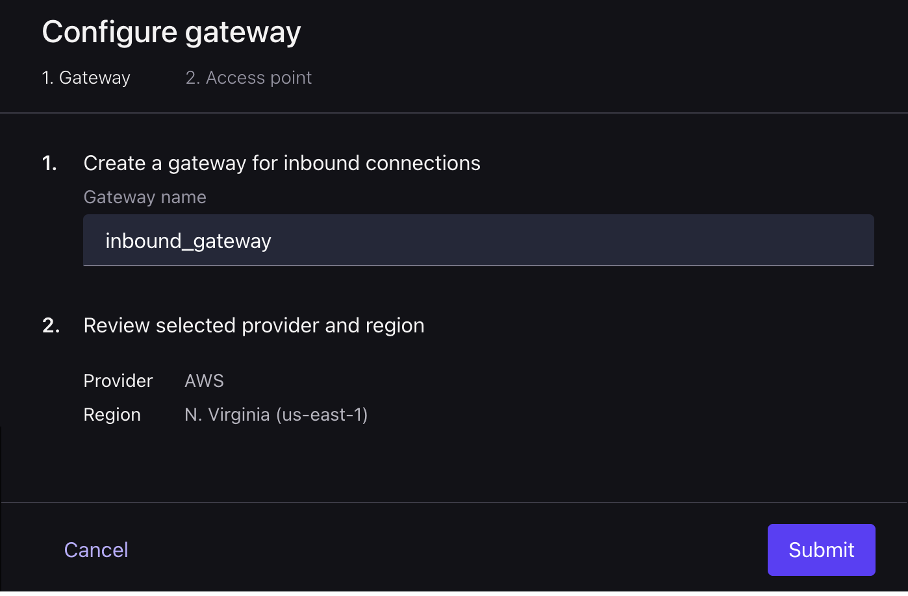
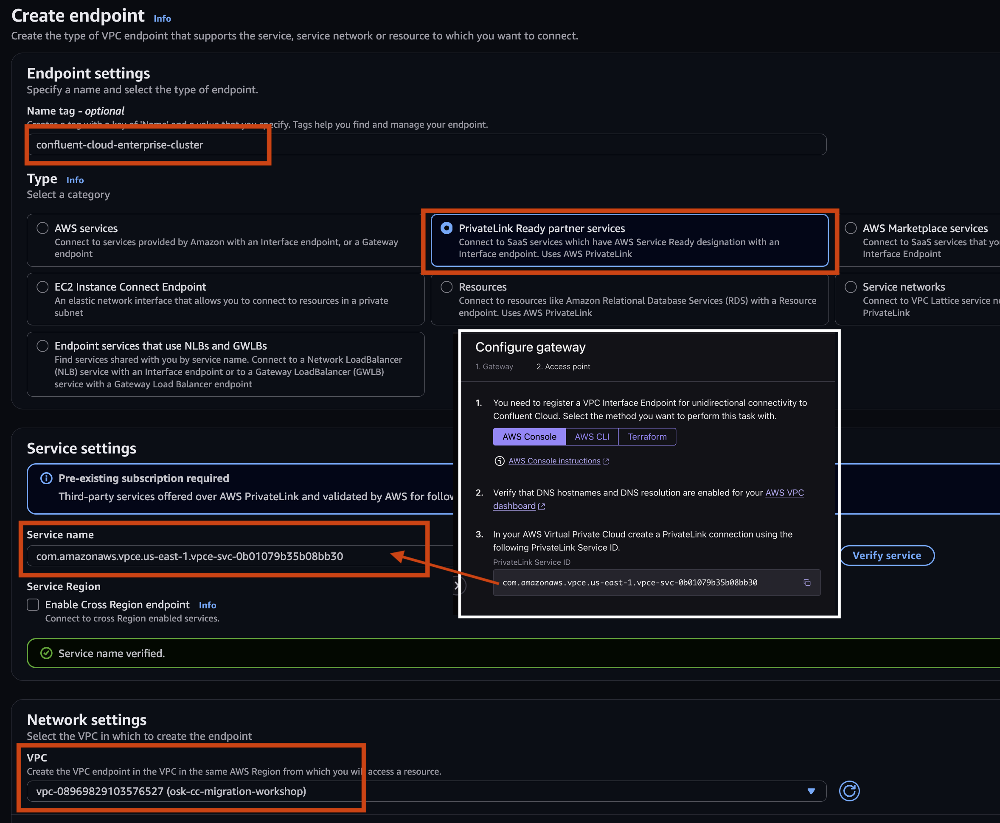
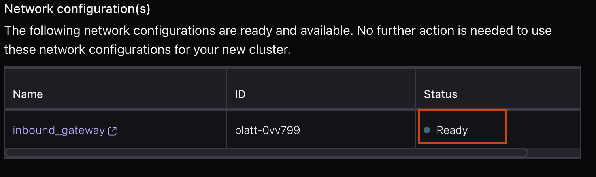

# <div align="center">Data Migration from Apache Kafka to Confluent Cloud</div>
<br>

This repository provides a demonstration of migrating data from Open Source Kafka to Confluent Cloud using Cluster Linking.

## **Architecture**

<div align="center">
    
</div>

<br>

## **Objective:**

**Acme.com**, a mid-sized e-commerce company runs a self-managed Open-Source Apache Kafka (OSK) cluster on-premises to handle real-time order events. As their customer base grows, maintaining uptime, scaling storage, and ensuring disaster recovery becomes increasingly challenging. To overcome these limitations and reduce operational overhead, they plan to migrate their data pipeline to Confluent Cloud.

This workshop simulates that scenario by:

- Setting up a local Kafka cluster to act as the on-prem system.
- Producing order events to simulate real-world workloads.
- Establishing a **Destination-Initiated Cluster Link** to pull topics and messages into Confluent Cloud.
- Validating successful data replication.
- Reconfiguring producers and consumers to point to Confluent Cloud, ensuring that consumers pick up from the latest offset post-migration.

By the end, participants will understand the complete migration process and key considerations for moving production workloads to the cloud.

<br>


## Prerequisites

Before you begin, ensure you have the following installed:

- **Confluent Cloud Account**
    - Sign-up for a Confluent Cloud account [here](https://www.confluent.io/confluent-cloud/tryfree/)
    - Once you have signed up and logged in, click on the menu icon at the upper right hand corner, click on "Billing & payment", then enter payment details under “Payment details & contacts”. A screenshot of the billing UI is included below.

    > **Note:** You will create resources during this workshop that will incur costs. When you sign up for a Confluent Cloud account, you will get free credits to use in Confluent Cloud. This will cover the cost of resources created during the workshop. More details on the specifics can be found [here](https://www.confluent.io/confluent-cloud/tryfree/).

- [Terraform](https://www.terraform.io/downloads.html) - v1.5.7 or later. 
- [AWS CLI (Optional)](https://aws.amazon.com/cli/) configured with appropriate credentials.
- [Kafka CLI (Optional)](https://kafka.apache.org/downloads) 
- [Confluent CLI (Optional)](https://docs.confluent.io/confluent-cli/current/install.html) - If on MAC run `brew install confluentinc/tap/cli`. 

<details>
<summary>Installing prerequisites on MAC</summary>

Install the prerequisites by running:

```bash
brew install git terraform confluentinc/tap/cli awscli
```

Install **Kafka command-line interface (CLI)** on your laptop without running a local Kafka server.

1. Download the Kafka binaries:

    ```
    cd /$HOME
    curl -O https://downloads.apache.org/kafka/3.9.0/kafka_2.13-3.9.0.tgz
    tar -xzf kafka_2.13-3.9.0.tgz
    mv kafka_2.13-3.9.0 kafka
    ```

2. Configure Your System's PATH:

    2.1. Open your shell profile file. This is typically `~/.zshrc` for Zsh (the default on modern macOS) or `~/.bash_profile` or `~/.bashrc` for Bash.

    2.2. Add the following line to the end of the file.

    ```
    export PATH="$PATH:$HOME/kafka/bin"
    ```

    2.3. Apply the changes by restarting your terminal or running `source ~/.zshrc` (or the appropriate file for your shell).


</details>

<details>
<summary>Installing prerequisites on Windows</summary>

Install the prerequisites by running:

```powershell
winget install --id Git.Git -e
winget install --id Hashicorp.Terraform -e
winget install --id ConfluentInc.Confluent-CLI -e
winget install --id Amazon.AWSCLI -e
winget install --id Microsoft.OpenJDK.17 -e
```

Install **Kafka command-line interface (CLI)** on your laptop without running a local Kafka server.
`
1. Go to the [Apache Kafka downloads](https://kafka.apache.org/downloads) page and find the archive for `2.13-3.9.0`. Download the binary `.tgz` file.
2. Windows doesn't natively handle `.tgz` files well. Use a tool like **7-Zip** to extract the contents. Extract the files to a simple path, like `C:\kafka`.
3. The Kafka CLI scripts for Windows are located in the `bin\windows` directory.

    3.1. Open the "Environment Variables" settings:

       - Press `Win + S` and search for "Edit the system environment variables."

       - Click the "Environment Variables..." button.

    3.2. Edit the Path variable: In the "System variables" section, find and select the `Path` variable, then click "Edit."

    3.3. Add the Kafka `bin\windows` path:

       - Click "New" and paste the full path to the `bin\windows` directory inside your extracted Kafka folder (e.g., `C:\kafka\bin\windows`).

       - Save your changes by clicking "OK" on all the windows.

       - Restart your Command Prompt or PowerShell for the changes to take effect.

</details> 


<br>


## Setup your Laptop

1. Launch a command terminal window and clone the repository:

    ```bash
    git clone https://github.com/confluentinc/confluent-workshops.git
    cd confluent-workshops/workshop/cluster_linking_osk_cc_private
    ```
2. Change directory to the downloaded repository's terraform directory.

   ```
   cd terraform
   ```
   
3. Steps to launch **AWS Workspace Studio** and get AWS credentials - Refer to the document [here](https://docs.google.com/document/d/1eD0aB5W6TsAC2J77_KvBNIsTBZ7Ak7ZhOKWb_r2zzBA/edit?tab=t.0)

   > ⚠️ **Note:**  If you already have the AWS CLI configured on your machine and pointing to the correct AWS account, you can skip this step.
   
4. Run the following command to configure the AWS credentials on your terminal window.

   Commands for MAC:
       
   ```bash
   export AWS_DEFAULT_REGION="<cloud_region>"
   export AWS_ACCESS_KEY_ID="<AWS_API_KEY>"
   export AWS_SECRET_ACCESS_KEY="<AWS_SECRET>"
   export AWS_SESSION_TOKEN="<AWS_SESSION_TOKEN>"
   ```
   Commands for Windows:

   ```bash
   set AWS_DEFAULT_REGION="<cloud_region>"
   set AWS_ACCESS_KEY_ID="<AWS_API_KEY>"
   set AWS_SECRET_ACCESS_KEY="<AWS_SECRET>"
   set AWS_SESSION_TOKEN="<AWS_SESSION_TOKEN>"
   ```
<br>


## <a name="step-1"></a>Step 1: Install and Provision Open-Source Kafka (OSK) 

In this section, you will use a Terraform script to provision an OSK instance on an AWS EC2 machine and set up a Jumpbox for running CLI commands. Follow the steps below to complete the setup:

1. Ensure that you're in the directory of the downloaded GitHub repository within your terminal window. Also, confirm that the following environment variables are set for AWS access:

    ```
    AWS_ACCESS_KEY_ID="<AWS_API_KEY>"
    AWS_SECRET_ACCESS_KEY="<AWS_SECRET>"
    AWS_SESSION_TOKEN="<AWS_SESSION_TOKEN>"
    ```

2. Change directory to `terraform` directory (if not already done):
    ```
    cd terraform
    ```
3. Initialize Terraform

   ```bash
   terraform init
   ```

6. Deploy OSK using Terrform

   ```bash
   terraform apply --auto-approve
   ```

Terraform will take around 10 mins to deploy and initialize OSK on AWS EC2 instance.


<br>


## <a name="step-2"></a>Step 2: Set up Confluent Cloud and Create a Enterprise Cluster

1. Log in to [Confluent Cloud](https://confluent.cloud) and enter your email and password.

2. If this is your first login, you may see a self-guided wizard that helps you create a cluster. Please minimize it, as we’ll go through those steps during the workshop. If not, you can simply skip this and move to the next instruction.

3. Click **Environments** on the left pane of the Web console and click **+ Add cloud environment** button on the right. Specify an **Environment Name** and Click **Create**. 

    > ⚠️ **Note:** An environment contains clusters and its deployed components such as Connectors, ksqlDB, and Schema Registry. You have the ability to create different environments based on your company's requirements. Confluent has seen companies use environments to separate Development/Testing, Pre-Production, and Production clusters.
    
    >There is a *default* environment ready in your account upon account creation. You can use this *default* environment for the purpose of this workshop if you do not wish to create an additional environment.

4. With your environment ready, click Create Cluster. If this option isn’t visible, the Web Console has already redirected you to the cluster creation page. In that case, proceed to the next step.

    > ⚠️ **Note:** Confluent Cloud clusters are available in 5 types: Basic, Standard, Enterprise, Dedicated, and Freight. Basic is intended for development use cases so you will use that for the workshop. Basic clusters only support single zone availability. Standard, Enterprise, Freight, and Dedicated clusters are intended for production use and support Multi-zone deployments. If you are interested in learning more about the different types of clusters and their associated features and limits, refer to this [documentation](https://docs.confluent.io/current/cloud/clusters/cluster-types.html).

5. Enter a cluster name of your choice, and select the **Enterprise** Cluster Type. 

<div align="center" padding=25px>
    
</div>
   
6. Select Provider as **AWS** and Region as **N. Virginia (us-east-1)**.

7. Select Networking as **PrivateLink** and click **Create new network** button.

<div align="center" padding=25px>
     
</div>

8. In the Configure gateway pane, provide a Gateway name. Make sure your Region is **N. Virginia (us-east-1)**. Click **Submit** button.

<div align="center" padding=12px>
     
</div>

9. In the Configure gateway Access point pane, click **AWS Console instructions** link to open the **Create a VPC Endpoint** page. Follow the instructions to **Create a VPC Endpoint**, **Create a PrivateLink Attachment Connection**, and **Set up DNS resolution** on AWS.

    > ⚠️ **Hints:** Refer to the following for creating the endpoints:

   I. In the AWS Management Console, go to the [VPC dashboard](https://us-east-1.console.aws.amazon.com/vpcconsole/home?region=us-east-1#vpcs:)

   II. Click the VPC ID of the `osk-cc-migration-workshop` VPC and click **Actions** and subsequently select **Edit VPC settings** from the drop-down menu.
   
   III. Under **DNS settings**, verify that **Enable DNS resolution** and **Enable DNS hostnames** are selected and then click **Save**.
   
   IV. Click [Endpoints](https://us-east-1.console.aws.amazon.com/vpcconsole/home?region=us-east-1#Endpoints:) and click **Create endpoint**.
   
   V. Use the following screenshot as a guide to create the endpoint. Make sure to copy the **Service name** from the Confluent Cloud console -> Configure gateway -> Access point pane -> **PrivateLink Service ID**.

    <div align="center" padding=25px>
     
    </div>  

    <div align="center" padding=25px>
     
    </div> 

   VI. Click the newly created **VPC endpoint id**. Copy the **Endpoint ID** and **DNS names** in a notepad for future reference.

    <div align="center" padding=25px>
     
    </div> 

   VII. Add the **Endpoint ID** to the Confluent Cloud Console -> Configure gateway -> Access point pane -> **VPC Endpoint ID from AWS** text field. </br>
   
   IV. Enter the Access point name as **osk-access-point** and click **Create access point** button.

    <div align="center" padding=25px>
     
    </div> 

   VIII. Copy the **DNS Domain** text for setting up DNS configuration on AWS. Click Finish.</br>
   
   IX. Setting up DNS Configuration on AWS Console -> [Route 53](https://us-east-1.console.aws.amazon.com/route53/v2/home?region=us-east-1#GetStarted). Select **Create hosted zones** and click **Get Started** </br>

        Create a Private Hosted Zone:

    <div align="center" padding=25px>
     
    </div> 

        Create a **CNAME** Record:

    <div align="center" padding=25px>
     
    </div> 

    <div align="center" padding=25px>
     
    </div> 

11. Make sure the **inbound_gateway** network configuration is in **Ready** state.

    <div align="center" padding=25px>
     
    </div> 

12. Click **Launch Cluster** button to launch the Enterprise Cluster.


<br>


## <a name="step-3"></a>Step 3: Explore the Confluent Cloud Enterprise Cluster

In this section, you will explore the Enterprise Cluster uaing the Web console and retrive the cluster settings to be used later in the workshop.

1. Go to your Environment and click on the newly launched cluster.
2. You see various option on the left. Click Cluster Overview option and subsequently click Cluster Settings.
3. On the Cluster Settings page, expand **PRIVATE_LINK** Endpoint and copy the **Bootstrap** value in your notepad. Also copy the **Cluster ID**.

    <div align="center" padding=25px>
     
    </div> 

4. Feel free to explore Networking. 

<br>

## <a name="step-4"></a>Step 4: Create an API Key Pair for Accessing the Confluent Cloud Enterprise Cluster

1. Swith to the Confluent Cloud Web console and navigate to the **Cluster Overview** section of your Enterprise Cluster.
2. Click **API keys** on the left sidebar menu. 
2. If this is your first API key within your cluster, click **Create key**. If you have set up API keys in your cluster in the past and already have an existing API key, click ** + Add key**.
   
    <div align="center" padding=25px>
       
    </div>

3. Select **My Account**, then click Next. Give it a description and click **Download and continue**
4. Save your API_KEY and API_SECRET - you will need these during the workshop.

<br>


## <a name="step-5"></a>Step 5: Connect to Open-Source Kafka (OSK) and Produce Messages

In this section, you will SSH into a **jumpbox VM** to run all the CLI commands. You'll then create a new topic on the Kafka server and use the Kafka CLI tools to produce and consume messages.

1. Change directory to `terraform` directory (if not already done). Run the following command to find the EC2 instance public IP:
   
   ```bash
   terraform output
   ```

   Copy the output values in a notepad. It should look like this:

   ```
    ec2_instance_vpc_id = "vpc-xxxxxxxxxxxxxxxxxx"
    jumpbox_public_ip = "XX.XX.XX.XX"
    kafka_public_ip = "XX.XX.XX.XX"
   ```

2. Use the following command to connect to the jumpbox instance via SSH:

    ```
    ssh -i my-tf-key.pem ec2-user@<jumpbox_public_ip>
    ```

    **Replace `<jumpbox_public_ip>` with the actual Jumpbox public IP.** Enter `yes` when prompted about fingerprinting.

3. Execute the commands below in your **Jumpbox terminal window** to set up the environment variables. Be sure to replace the placeholders with the actual values.

   Commands for MAC:
       
   ```bash
   export API_KEY="<api_key created to access the Enterprise Cluster>" 
   export API_SECRET="<api_secret created to access the Enterprise Cluster>"
   export ENTERPRISE_CLUSTER_BOOTSTRAP="<bootstrap value of the Enterprise Cluster including port number>"
   export KAFKA_PUBLIC_IP="<Public IP of your OSK Cluster, from terraform output command>" 
   ```
   Commands for Windows:

   ```bash
   set API_KEY="<api_key created to access the Enterprise Cluster>" 
   set API_SECRET="<api_secret created to access the Enterprise Cluster>"
   set ENTERPRISE_CLUSTER_BOOTSTRAP="<bootstrap value of the Enterprise Cluster including port number>"
   set KAFKA_PUBLIC_IP="<Public IP of your OSK Cluster, from terraform output command>" 
   ```

4. Execute the following command to find the cluster ID for an open-source Apache Kafka installation. 

    ```bash
    kafka-cluster.sh cluster-id --bootstrap-server $KAFKA_PUBLIC_IP:9092
    ```

    You’ll see an output like `Cluster ID: xxxxxxxxxxxxxxx`. Make sure to copy it, as you’ll need it later when setting up cluster linking.

    > ⚠️ **Note:** If you see the error **kafka-cluster.sh: command not found** in your terminal, run the following command to update the system PATH environment variable.
    
   ```bash
    source ~/.bash_profile
   ```

5. Create a topic in Apache Kafka using the following command. You will use the `kafka-topics.sh` utility to create the topic:
    
    ```bash
    kafka-topics.sh --create --bootstrap-server $KAFKA_PUBLIC_IP:9092 --topic test-topic --partitions 1 --replication-factor 1
    ```

6. Produce some sample data using the `kafka-console-producer.sh` utility.

    > ⚠️ **Note:** In a real-world scenario, your applications or microservices would produce and consume messages by connecting to a Kafka cluster using configuration parameters such as bootstrap servers, API keys, and others. 

    ```bash
    kafka-console-producer.sh --bootstrap-server $KAFKA_PUBLIC_IP:9092 --topic test-topic
    ```

    Your terminal shows the prompt:

    ```
    >
    ```

    You type your first message and press Enter:

    ```
    > Hello Kafka
    ```

    The message "Hello Kafka" is now published to `test-topic`. The prompt appears again, ready for the next message:

    ```
    > This is a second message.
    ```

    The message "This is a second message." is published. You then press **Ctrl+C** to exit the producer.

7. Consume the messages using the `kafka-console-consumer.sh` utility. Also specify a consumer group - `my-consumer-group`.

    ```bash
    kafka-console-consumer.sh --bootstrap-server $KAFKA_PUBLIC_IP:9092 --topic test-topic --group my-consumer-group --from-beginning
    ```

    Make sure you see both the message you produced in the previous steps. You then press **Ctrl+C** to exit the consumer.

8. View the consumer group offsets and lag by using the `kafka-consumer-groups.sh` utility. 

    ```bash
    kafka-consumer-groups.sh --bootstrap-server $KAFKA_PUBLIC_IP:9092 --describe --group my-consumer-group
    ```

    The command will produce a table with the following important columns:

    ```
    GROUP             TOPIC           PARTITION  CURRENT-OFFSET  LOG-END-OFFSET  LAG     ...           
    my-consumer-group test-topic      0          2               2               0       ...
    ```

    A brief explanation of the columns:

    - **CURRENT-OFFSET**: The last offset that the consumer group has successfully committed. This is the position where the consumer will resume reading from if it restarts.

    - **LOG-END-OFFSET**: The offset of the newest message written to the partition. This is also known as the "High Watermark".

    - **LAG**: The difference between LOG-END-OFFSET and CURRENT-OFFSET. This is the number of messages the consumer group has yet to consume. A high or consistently growing lag indicates that your consumers are not keeping up with the producers.    


<br>


## <a name="step-6"></a>Step 6: Set up Cluster Linking on Confluent Cloud

With the prerequisites complete, you can now configure the Cluster Link. This process involves creating a link on your destination cluster (Confluent Cloud Enterprise Cluster) that points to your source (Apache Kafka) cluster. You’ll use the `Confluent CLI` from your **Jumpbox** terminal to perform this setup.

To set up Cluster Linking, follow these steps:

1. Login to Confluent Cloud using the following command:

    ```
    confluent login --no-browser
    ```

    Enter the registered email address you used when signing up for Confluent Cloud. You’ll receive a web link—open it in a browser to generate a token. Copy the token and paste it into your terminal.

    > ⚠️ **Note:** If you belong to multiple organizations in Confluent Cloud, use the `--organization` flag to specify the organization containing the Enterprise Cluster you created earlier.    


2. Identify your Environment that you used to create the Enterprise Cluster:

    ```
    confluent environment list
    ```

    It will list out all the Environments in your organization and display their ENVIRONMENT_ID.

3. Switch to that Environment using the following command (replace <ENVIRONMENT_ID> with the actual value):

    ```
    confluent environment use <ENVIRONMENT_ID>
    ```

4. Similarly, find and switch to your Enterprise Cluster:

    ```
    confluent kafka cluster list

    confluent kafka cluster use <ENTERPRISE_CLUSTER_ID>
    ```
5. Creat a configuration file - `cluster_link.config` to create cluster linking. The configuration file is typically a simple key-value pair format, often structured as a Java properties file (i.e., one setting per line, with key=value). Each property defines a specific aspect of the cluster link, such as replication behavior, security credentials, inclusion/exclusion filters, and more.

    ```
    cat > cluster_link.config << EOF
    auto.create.mirror.topics.enable=true
    auto.create.mirror.topics.filters={"topicFilters":[{"name":"*","patternType":"LITERAL","filterType":"INCLUDE"}]}
    consumer.offset.sync.enable=true
    consumer.offset.group.filters={"groupFilters":[{"name":"*","patternType":"LITERAL","filterType":"INCLUDE"}]}

    EOF
    ```

    A brief explanation of the options:

    - `auto.create.mirror.topics.enable`: Determines whether new topics created on the source cluster are automatically mirrored to the destination cluster.
    - `auto.create.mirror.topics.filters`: Controls which topics are eligible to be automatically mirrored. Uses filter rules to specify inclusion or exclusion by name or pattern type. In this case, its all the topics.
    - `consumer.offset.sync.enable`: Enables or disables the synchronization of consumer group offsets between clusters.
    - `consumer.offset.group.filters`: Specifies which consumer groups’ offsets will be mirrored using inclusion/exclusion filter logic. In this case, it mirrors offsets for all consumer groups in the source cluster.

6. Create a destination-initiated (in this case, the destination is the Enterprise cluster) cluster link namely `osk-cc-link` by running the following command:

    ```
    confluent kafka link create osk-cc-link --source-cluster <APACHE_KAFKA_CLUSTER_ID> --source-bootstrap-server $KAFKA_PUBLIC_IP:9092 --config ./cluster_link.config --cluster <ENTERPRISE_CLUSTER_ID>
    ```

    > ⚠️ **Note:** You can extract the <APACHE_KAFKA_CLUSTER_ID> by using the `kafka-cluster.sh cluster-id --bootstrap-server $KAFKA_PUBLIC_IP:9092` command. Make sure to replace the placeholders with their actual values.

    Once the link is create successfully, you can see the following output:

    <div align="center" padding=25px>
       
    </div>

7. Wait for **7-to-9 minutes** before the cluster link is initialized. You can use the following command to view the state of the tasks:

    ```
    confluent kafka link task list osk-cc-link
    ```

    Once, everything is initialized you will see the following message:

    <div align="center" padding=25px>
       
    </div>


<br>


## <a name="step-7"></a>Step 7: Verifying the Creation of the Mirror Topic in the Enterprise Cluster

To verify creation of the mirror topics, execute the following steps:

1. Switch to the **Jumpbox** terminal window.

2. To list all the mirror topics associated with the cluster link, use the following command:

    ```bash
    confluent kafka mirror list
    ```

3. To check the status and details of a specific mirror topic, execute the following command:

    ```bash
    confluent kafka mirror describe test-topic --link osk-cc-link
    ```

    Look for the **Mirror Status** to ensure it is in an `Active` state and pulling records from the source.

4. Use the `Confluent` CLI to read from the mirror topic:

    ```
    confluent kafka topic consume test-topic --api-key $API_KEY --api-secret $API_SECRET --bootstrap $ENTERPRISE_CLUSTER_BOOTSTRAP --from-beginning
    ```

    You will see all the data getting replicated from Apache Kafka to Confluent Cloud. Press CTRL+C to exit.


5. Try to write some data to the mirror topic and see what happens:

    ```
    confluent kafka topic produce test-topic --api-key $API_KEY --api-secret $API_SECRET --bootstrap $ENTERPRISE_CLUSTER_BOOTSTRAP

    ```

    The above command will prompt you to enter some message. While adding some messages you will probably encounter errors like - `failed to produce offset -1: Broker: Invalid request`. Press **Ctrl+C** to exit.

    You cannot write (produce) directly to mirror topics in a Confluent Kafka environment where cluster linking or topic mirroring is configured. 

<br>


## <a name="step-8"></a>Step 8: Make the Mirror Topic Writable

The mirror topics are read-only by default. To make a mirror topic writable (i.e., change it from read-only, mirrored state to a regular, independent, writable topic) in Confluent Kafka (whether in Confluent Platform or Confluent Cloud with Cluster Linking), you need to use either the promote or failover command. This operation is commonly called “promoting” the mirror topic, and is an essential step in cutover, DR, or migration workflows.

> ⚠️ **Note:** Mirror topics are read-only topics created and owned by a cluster link. You cannot directly write to these topics; only the cluster link can synchronize data from the source topic. To make the topic writable, you must “convert” it to a regular topic by stopping (detaching) it from the cluster link. This is done by either promoting or failing over the topic. Once promoted or failed over, the mirror topic will permanently stop syncing from its source, and you can produce records to it like any other topic. **This operation cannot be reversed—you would need to recreate the topic as a mirror topic if you want to re-establish mirroring**.

Execute the following steps to make the mirror topic writable:

1. Confirm the current status of the mirror topic (and check that mirroring lag is zero if doing a planned migration).

    ```bash
    confluent kafka mirror describe test-topic --link osk-cc-link
    ```

    To promote, ensure network reachability between the destination and source clusters, and that lag is zero.

2. Promote the mirror topic.

    ```bash
    confluent kafka mirror promote test-topic --link osk-cc-link --cluster <ENTERPRISE_CLUSTER_ID>
    ```

    This will check lag, synchronize everything, and make the topic writable only if fully caught up.

    > ⚠️ **Note:** 
    >
    > **Promote**: Use when both the source and destination clusters are healthy and there is no mirroring lag. The promote command guarantees that the mirror topic is fully caught up and all relevant metadata (including consumer offsets) is synchronized from source to mirror before making it writable. This is the recommended operation for planned cutovers or migrations. 
    > 
    > **Failover**: Use if the source cluster is unavailable or in disaster scenarios. The failover command will forcibly convert the mirror topic to a writable topic regardless of synchronization status (which may result in some data or offset lag).
    Both commands must be executed on the destination cluster—the cluster hosting the mirror topic.

3. Validate that the topic is now writable by producing new records. For example, execute the following command:

    ```bash
    confluent kafka topic produce test-topic --api-key $API_KEY --api-secret $API_SECRET --bootstrap $ENTERPRISE_CLUSTER_BOOTSTRAP
    ```

4. Check whether the new messages are written to the mirror topic:

    ```bash
    confluent kafka topic consume test-topic  --api-key $API_KEY --api-secret $API_SECRET --bootstrap $ENTERPRISE_CLUSTER_BOOTSTRAP --from-beginning
    ```

5. Check topic state. The topic state will be `STOPPED` when it is writable (no longer mirroring).

    ```bash
    confluent kafka mirror describe test-topic --link osk-cc-link
    ```

<br>


## <a name="step-9"></a>Step 9: Produce and Consume Data from Confluent Cloud

In this section, you will simulate a typical producer and consumer migration using the `kafka-console-*` utility. In a real-world scenario, your microservices would handle the business logic, and you would only need to update the configurations of your microservices to connect to your Confluent Cloud cluster instead of the Apache Kafka cluster for producing and consuming messages new records.

1. Produce some sample data using the `kafka-console-producer.sh` utility:  

    ```bash
    kafka-console-producer.sh \
    --bootstrap-server $ENTERPRISE_CLUSTER_BOOTSTRAP \
    --topic test-topic \
    --producer-property security.protocol=SASL_SSL \
    --producer-property sasl.mechanism=PLAIN \
    --producer-property "sasl.jaas.config=org.apache.kafka.common.security.plain.PlainLoginModule required username=\"$API_KEY\" password=\"$API_SECRET\";"
    ```

    Press **Ctrl+C** to exit the producer.

3. Consume the messages using the `kafka-console-consumer.sh` utility:

    ```bash
    kafka-console-consumer.sh \
    --bootstrap-server $ENTERPRISE_CLUSTER_BOOTSTRAP \
    --topic test-topic \
    --from-beginning \
    --consumer-property security.protocol=SASL_SSL \
    --consumer-property sasl.mechanism=PLAIN \
    --consumer-property "sasl.jaas.config=org.apache.kafka.common.security.plain.PlainLoginModule required username=\"$API_KEY\" password=\"$API_SECRET\";"
    ```

    Make sure you see four messages. The one created on Confluent Kafka as well as OSK.

6. View the consumer group offsets and lag by using the `kafka-consumer-groups.sh` utility: 

    ```bash
    kafka-consumer-groups.sh \
    --bootstrap-server $ENTERPRISE_CLUSTER_BOOTSTRAP \
    --describe \
    --group my-consumer-group \
    --command-config <(echo -e "security.protocol=SASL_SSL\nsasl.mechanism=PLAIN\nsasl.jaas.config=org.apache.kafka.common.security.plain.PlainLoginModule required username=\"$API_KEY\" password=\"$API_SECRET\";")
    ```

    The command will produce a table with the following important columns:

    ```
    GROUP             TOPIC           PARTITION  CURRENT-OFFSET  LOG-END-OFFSET  LAG     ...           
    my-consumer-group test-topic      0          2               2               0       ...
    ```

7. Consume only the new messages by specifying the consumer group.

    ```bash
    kafka-console-consumer.sh \
    --bootstrap-server $ENTERPRISE_CLUSTER_BOOTSTRAP \
    --topic test-topic \
    --group my-consumer-group \
    --consumer-property security.protocol=SASL_SSL \
    --consumer-property sasl.mechanism=PLAIN \
    --consumer-property "sasl.jaas.config=org.apache.kafka.common.security.plain.PlainLoginModule required username=\"$API_KEY\" password=\"$API_SECRET\";"
    ```

    You see that the consumer from `my-consumer-group` starts consuming only the new messages from Confluent Kafka.


<br>

## <a name="step-10"></a>Step 10: Clean up the Resources

Make sure to delete all the resources created if you no longer wish to use the environment.

1. Delete the `Endpoint` you created manually in your AWS Cloud.

    <div align="center" padding=25px>
       
    </div>

2. Run the following command to delete the all other AWS resources:

    ```bash
    cd workshop-XXXXXXX-XXXXXXX/terraform

    terraform destroy --auto-approve
    ```
3. Make sure to delete all the Confluent Cloud resources (Topics, Kafka cluster, Cluster Links) to save your credits.

<br>

## <a name="step-8"></a>Confluent Resources and Further Testing

* [Confluent Cloud Documentation](https://docs.confluent.io/cloud/current/overview.html)

* [Confluent Connectors](https://www.confluent.io/hub/) - A recommended next step after the workshop is to deploy a connector of your choice.

* [Confluent Cloud Schema Registry](https://docs.confluent.io/cloud/current/client-apps/schemas-manage.html#)

* [Best Practices for Developing Apache Kafka Applications on Confluent Cloud](https://assets.confluent.io/m/14397e757459a58d/original/20200205-WP-Best_Practices_for_Developing_Apache_Kafka_Applications_on_Confluent_Cloud.pdf) 

* [Confluent Cloud Demos and Examples](https://docs.confluent.io/platform/current/tutorials/examples/ccloud/docs/ccloud-demos-overview.html)

* [Kafka Connect Deep Dive – Error Handling and Dead Letter Queues](https://www.confluent.io/blog/kafka-connect-deep-dive-error-handling-dead-letter-queues/)
