## Objective

This project demonstrates how to build a **real-time data streaming application** powered by **Confluent Cloud**, leveraging its fully managed Kafka platform, Flink SQL-based stream processing and Tableflow integration capabilities. 

This application powers real-time personalization and analytics for an e-commerce platform. It displays trending products based on live view counts, offers personalized suggestions by analyzing cart activity and recommending similar or lower-priced items, and provides an analytics dashboard with metrics like views, cart additions, and conversion rates. A streaming data pipeline ensures the UI and analytics stay updated instantly with user behavior.


### The solution uses several key services from **Confluent Cloud**:

- **Kafka (Fully Managed)** – Reliable real-time messaging backbone for event-driven architecture
- **Debezium PostgreSQL CDC Connector** – Captures real-time database changes and streams them into Kafka
- **Datagen Connector** – Simulates product view events for testing and demos
- **Flink SQL** – Real-time processing and enrichment of data using SQL with minimal setup
- **Tableflow** – Streams enriched data from Kafka into **AWS S3 (Iceberg format)** and **Glue Catalog**, enabling analytics

### Key Use Cases Demonstrated

- Capture and stream data changes from PostgreSQL to Kafka in real time
- Generate synthetic events for simulating product views
- Use **Flink SQL** to build:
  - Trending products
  - Personalized recommendations
  - Enriched cart data
  - Analytics 
- Persist enriched streaming output to AWS S3 using **Confluent Tableflow**
- Sync metadata with **AWS Glue Catalog** for downstream querying

This project is ideal for developers, architects, and data engineers who want to:

- Learn how to build a **real-time pipeline using Confluent Cloud**
- Explore **stream processing** with **Flink SQL**
- See how **Tableflow** can seamlessly bridge Kafka and the data lake

All components are fully managed via Confluent Cloud, ensuring fast setup and minimal operational overhead.

## Prerequisites
Before you begin, ensure you have the following installed on your system:
- **Python 3** (latest stable version recommended)
- **AWS CLI** (configured with appropriate credentials and region)

<div style="border: 6px solid #555; padding: 16px; border-radius: 8px; margin: 16px 0;">
<details> 
<summary><strong>Steps for AWS Setup</strong></summary>
<br>

If you are using AWS Workshpace provided by Confluent, the CloudFormation stack `workshop-prep-stack` has already been deployed for you.

## Retrieve Stack Outputs

Once you launch the AWS Workspace studio provided by Confluent, 
1. Click on Open AWS Console


2. After opening the AWS Console, Search for Cloudformation in Search bar and Open Cloudformation workspace.
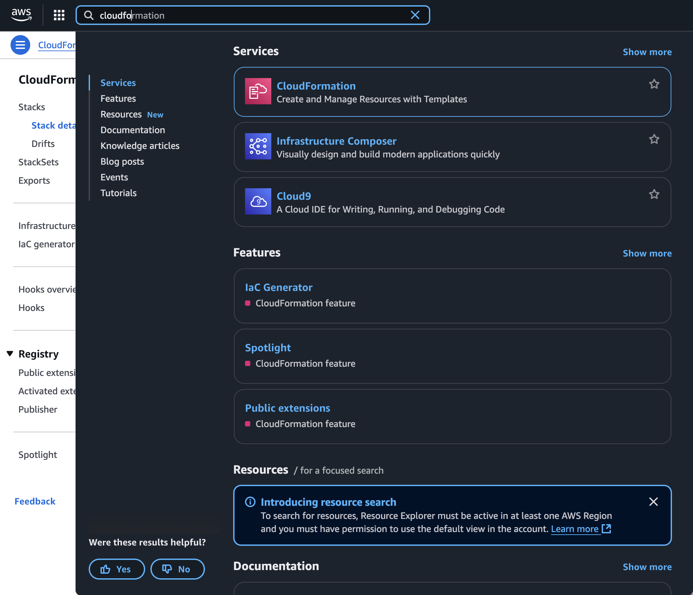

3. Open workshop-setup stack 
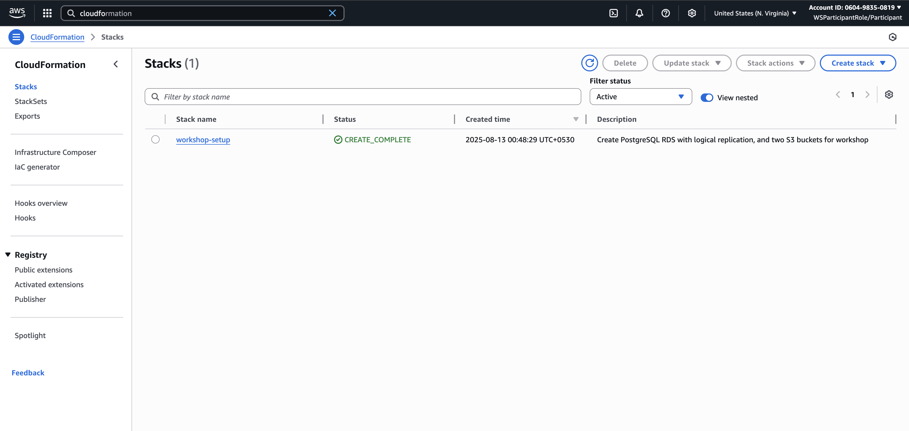

4. Open Output tab to access the details for updating .properties file
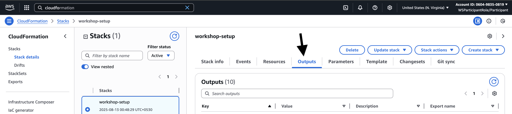

## Optional: For Personal AWS Account Users

If you're not using AWS Workshop Studio, you can deploy the CloudFormation stack manually in your account and follow the same steps above to extract values and update the files.

or

follow these instructions to manually create the required AWS resources in your own account.

### Step 1: Create a DB Parameter Group

Go to AWS Console > RDS > Parameter groups  
Click Create parameter group  
Parameter group family: postgres17  
Group name: dsp-pg-logical-replication  
Description: Enable logical replication

After creating, click the new group to Edit parameters.  
Find `rds.logical_replication`, set it to `1`, then click Save changes

:warning: If you're using a different PostgreSQL version (e.g., 15), choose the matching parameter group family like postgres15.

### Step 2: Create an RDS PostgreSQL Instance

Go to AWS Console > RDS > Databases > Create Database

Choose:

- Engine: PostgreSQL  
- Version: 17.5 (or latest available)  
- Template: Free tier (if applicable)  
- DB Instance Identifier: dsp-postgres-db  
- Master username: dspadmin  
- Master password: YourSecurePassword123! (or a strong password)  
- DB Name: dspdb  
- DB instance size: db.t3.micro or similar  
- Storage: 40 GiB  
- Enable Public access  
- VPC Security Group: create or select one that allows inbound access on port 5432 from your IP or 0.0.0.0/0 (:warning: public — for workshop use only)

In Additional configurations:  
Set parameter group with `rds.logical_replication = 1`  
If not available, create one under RDS > Parameter Groups.

Wait for the instance to be available, and note: Endpoint (host), Port, DB name, Username and Password  

### Create Two S3 Buckets

In S3 Console, create two buckets:

- Bucket 1: Athena Queries  
  Name: `dsp-athena-queries-<your-aws-account-id>`  
  Region: same as your RDS instance  
  Default settings are fine

- Bucket 2: Tableflow  
  Name: `dsp-confluent-tableflow-<your-aws-account-id>`  
  Region: same

Once your resources are ready, use their values in the `psqlclient.properties` and `aws.properties` files.
</details>
</div>

## Application Setup Instructions


### 1. Clone the Repository

```bash
git clone <your-repo-url>
cd <repo-name>/app
```

### 2. Set Up Python Environment

```bash
cd dsp-workshop
```
```bash
python3 -m venv venv
```
```bash
source venv/bin/activate
```

### 3. Install Required Packages

```bash
pip3 install fastapi uvicorn jinja2 sqlalchemy psycopg2-binary confluent-kafka python-multipart boto3 pandas plotly
```

---

## Confluent Cloud Setup

### 4. Sign UP to Confluent Cloud

To get started, you'll need an active **Confluent Cloud** account.

1. **Sign up** for a free account: [Confluent Cloud Signup](https://confluent.cloud)
2. Once logged in, click the **menu icon (top-right)** → go to **Billing & payment**
3. Under **"Payment details & contacts"**, enter your **billing information**

Note : When you sign up for a Confluent Cloud account, you will get free credits to use in Confluent Cloud. This will cover the cost of resources created during the workshop.

### 5. Create Infrastructure

1. Create a new **Environment** in [Confluent Cloud](https://confluent.cloud)
   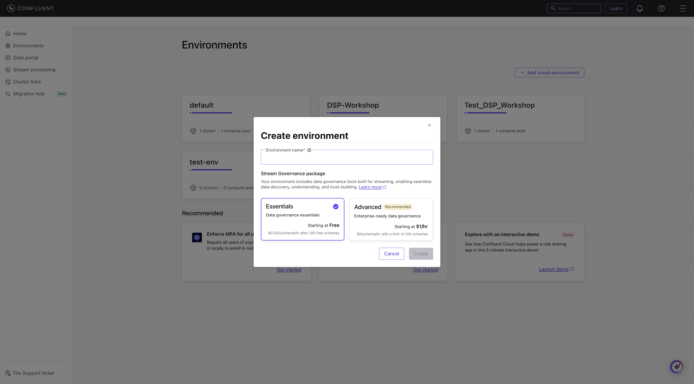
2. Create a **Standard Kafka Cluster** in your nearest region
   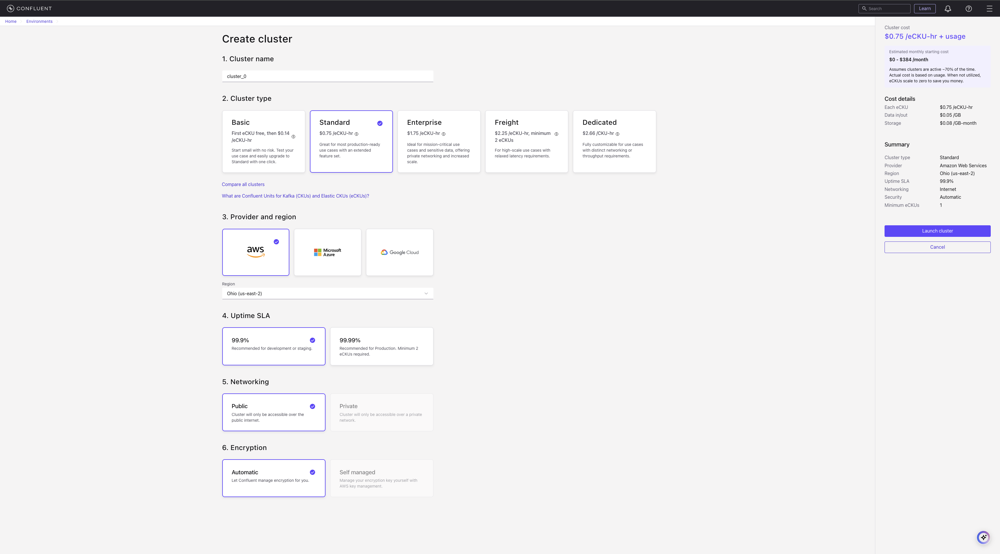
3. Generate **API Keys** and update the values in `client.properties`
#### Steps to Create API Keys
- Go to the **API Keys** section.
- Select **"My Account"** for generating the API keys.
   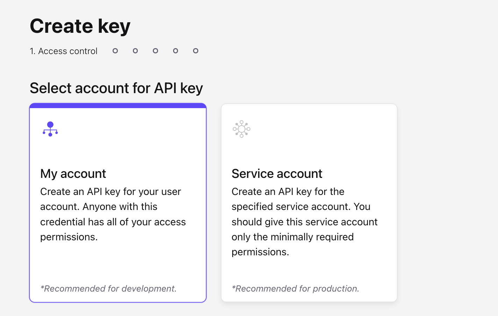
- Download the **API Key** and **Secret**, to update them in your `client.properties` file (All required values will be present in client.properties).
   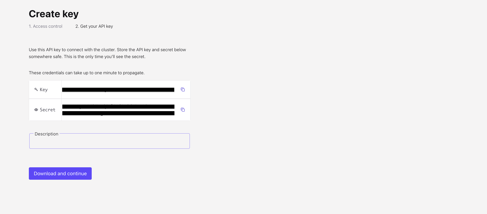

---

## Configuration

### 6. Update Property Files

Edit the following files and update them with your credentials, these files are present in `app` folder with `.properties` extension.

* Update `psqlclient.properties`

```
# PostgreSQL
postgres.user=<RDSUsername>
postgres.password=<RDSPassword>
postgres.host=<RDSInstanceEndpoint>
postgres.db=<RDSDatabaseName>
```
Replace the values above with the ones returned by your describe-stacks output from AWS

* Update `aws.properties` (For AWS Secret ID and Key, generate IAM user with admin permissions and update in aws.properties file)

```
aws.region=<Your AWS Region>
aws.access_key_id=<Your AWS ACCESS KEY>
aws.secret_access_key=<Your SECRET AWS ACCESS KEY>
athena.output_location=s3://<AthenaBucketName>/
athena.database=<your_confluent_cluster_id>         
athena.table=<your_confluent_topic_name>         
```
Replace the values above with the ones returned by your describe-stacks output from AWS 

* Update `client.properties` – Use API Keys and Bootstrap server details created in step-5. File which has been downloaded contains all the details to update client.properties

---

## Run the Application

### 7. Start FastAPI Server

```bash
uvicorn main:app --reload
```

This will start the server on:
[http://127.0.0.1:8000](http://127.0.0.1:8000)

---

### 8. Add Products to Database

To populate the product table with sample data, run:

* Open new tab in you terminal and go to dsp-workshop directory.
* Activate the virtual environment
```bash
source venv/bin/activate
```
```bash
cd app
```
```bash
python3 add-products.py
```

---

## Explore the Application (DSP is not enabled yet)

You can now:

* Log in to the application
* View the product catalog
* Try adding products to your cart

---

## Confluent Cloud Components Setup

### 9. Set Up Connectors

---

### CDC Source Connector (PostgreSQL)

Use the **Debezium PostgreSQL connector** to stream database changes into Kafka in real time.

### Steps to Create Postgres CDC Source V2 (Debezium) Connector

1. Go to the **Connectors** tab in Confluent Cloud and search for **"Postgres CDC Source V2 (Debezium)"**.
2. This will redirect you to the connector configuration page.
   * Select **"Use an existing API Key"** and provide the API key credentials you created earlier.
     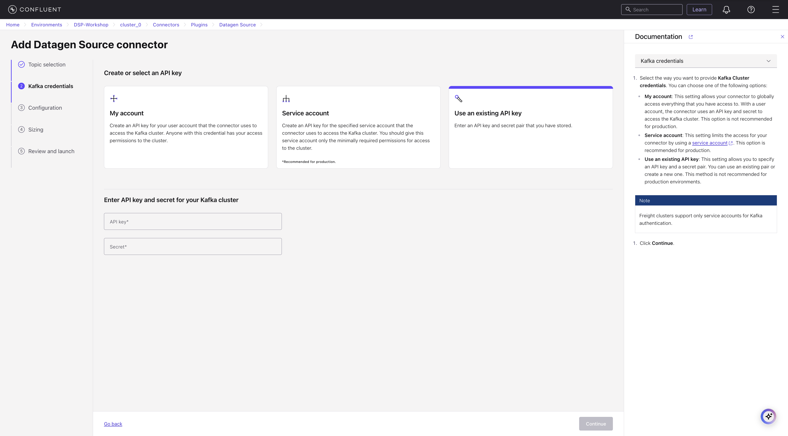
3. Add your **PostgreSQL connection credentials**.
   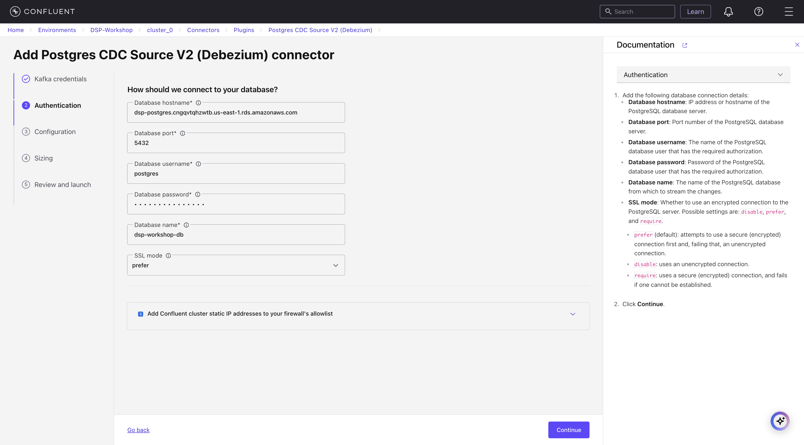
4. Click **Continue**. This will take a few moments to initialize.
5. In the **configuration page**, set the following values:
   * **Output record value format**: `JSON_SR`
   * **Output Kafka record key format**: `JSON_SR`
   * **Topic prefix**: `dsp` (You can use your own prefix)
   * **Slot name**: `debezium` (Customizable)
   * **Publication name**: `dbz_publication` (Customizable)
     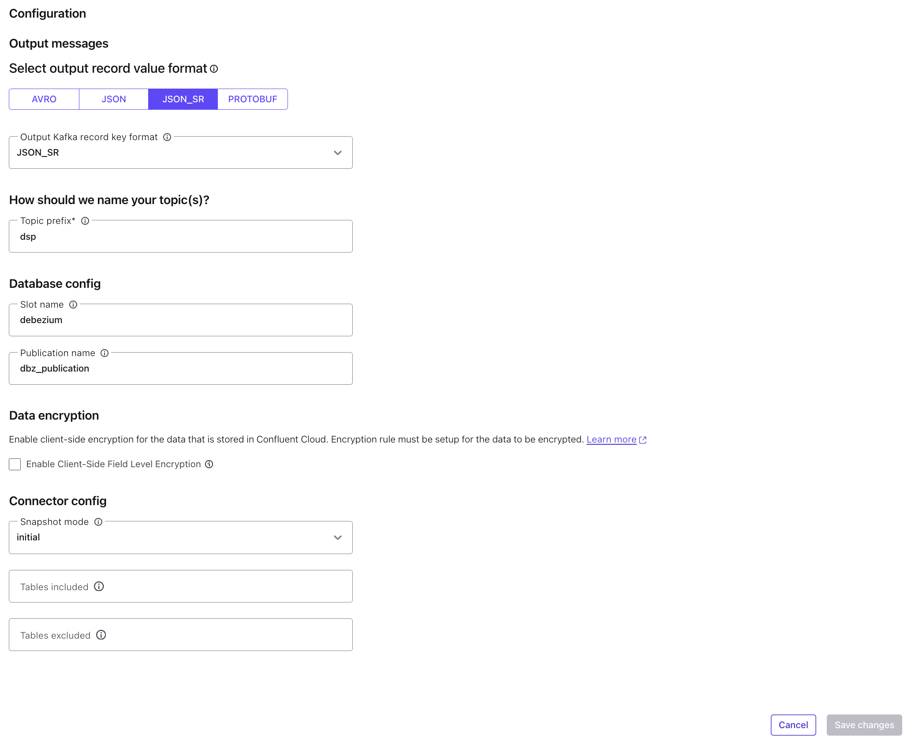
6. Click on **"Show Advanced Configurations"**:
   * Set **After-state only** to `true`
   * Scroll down for more options
     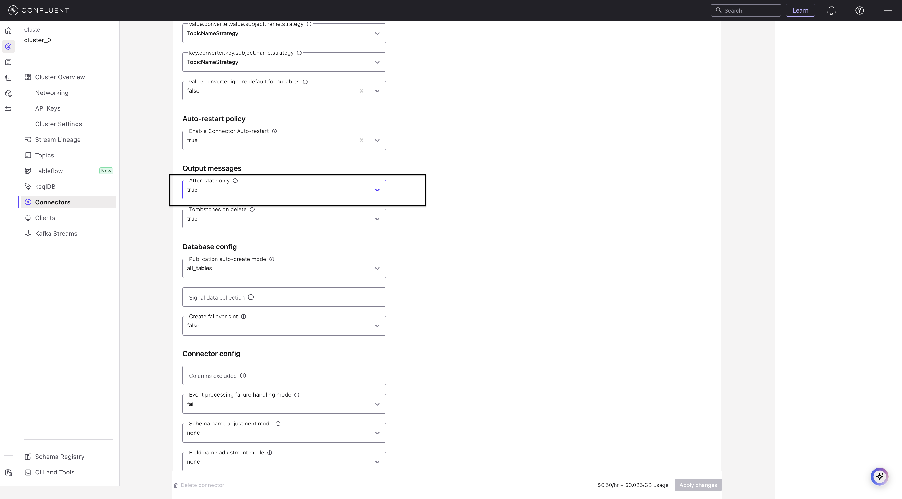
7. Click on **"Add SMT" (Single Message Transform)** and configure the following:
   * **Transform Type**: `TopicRegexRouter`
   * **Transformation Values**:
     * `regex: (.*)\.(.*)\.(.*)`
     * `replacement: $1_$2_$3`
       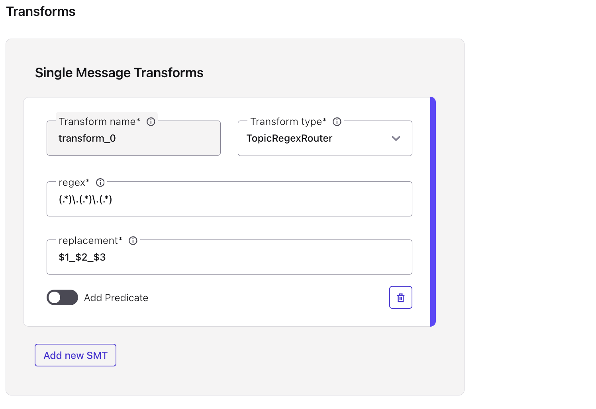
8. Click **Continue**.
   * Keep the default **connector sizing** options.
   * Click **Continue** again.
9. Update the **Connector Name**.
10. Click **Continue** and finally click **Create** to deploy the connector.

Once deployed, you can monitor the connector status and metrics from the **Connectors** tab.

---

### Datagen Connector

Use the **Datagen Source Connector** to simulate product view events in Kafka.

## Steps to Create Datagen Connector

1. Go to the **Connectors** tab in clusters and click on Add Connector
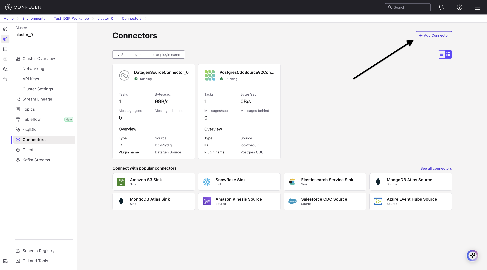
2. Search for **"Datagen Source"**.
   Click on **Additional Configuration**.
   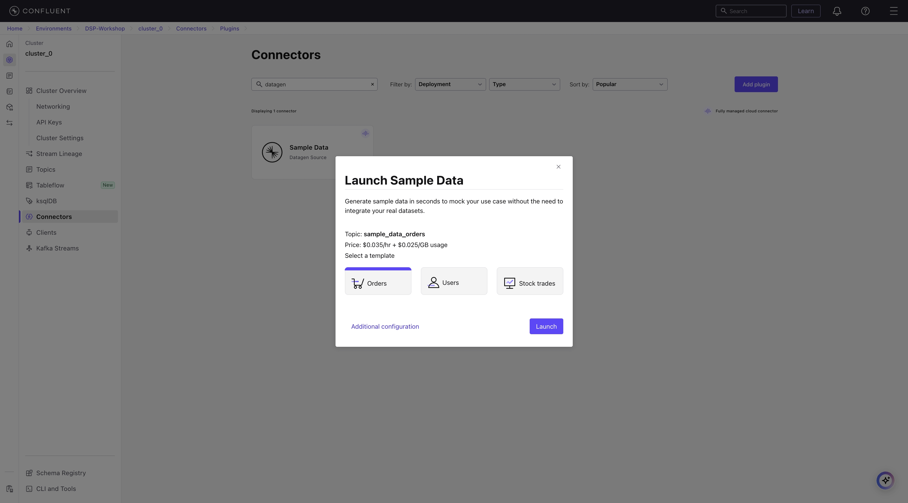
3. On the next page, create a topic named **`datagen_product_view`** with default configurations and select it for the connector.
4. Click **Continue** and select **"Use an existing API Key"**. Provide your API key credentials.
5. Choose **"Provide your own schema"** and paste the following JSON schema:
   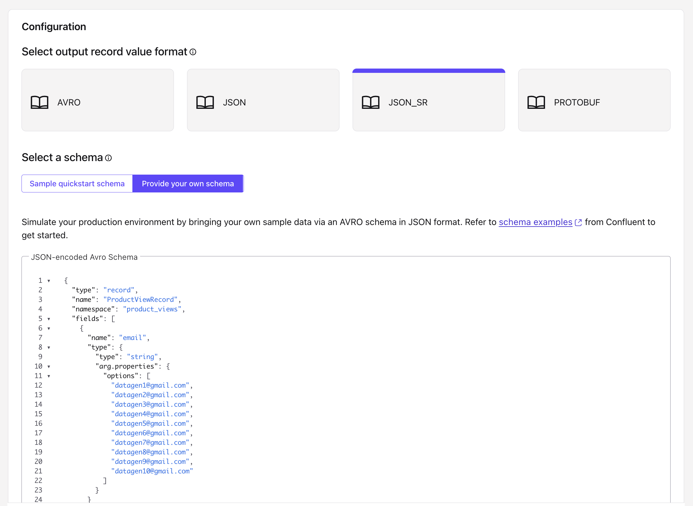
   ```json
   {
     "type": "record",
     "name": "ProductViewRecord",
     "namespace": "product_views",
     "fields": [
       {
         "name": "email",
         "type": {
           "type": "string",
           "arg.properties": {
             "options": ["datagen1@gmail.com", "datagen2@gmail.com", "datagen3@gmail.com", "datagen4@gmail.com", "datagen5@gmail.com"]
           }
         }
       },
       {
         "name": "product_id",
         "type": {
           "type": "int",
           "arg.properties": {
             "options": [1, 2, 3, 4, 5, 6, 7, 8, 9, 10]
           }
         }
       }
     ]
   }
   ```
6. Click **Continue**.
7. Keep the default **connector sizing** options.
8. Click **Continue** and Update the **Connector Name**.
9. Click **Continue**, review the settings, and **Create** the connector.

Once created, this connector will begin publishing simulated product view events to Kafka under the topic `datagen_product_view`.

---

## Flink Setup

### 10. Create Flink Compute Pool and Run Queries

Use Flink SQL to perform real-time analytics and transformations on your Kafka topics.

---

### Steps to Create Flink Compute Pool

1. Go to your **Confluent Cloud environment** and open the **Flink** tab.
2. Click on **“Create Compute Pool”**.

   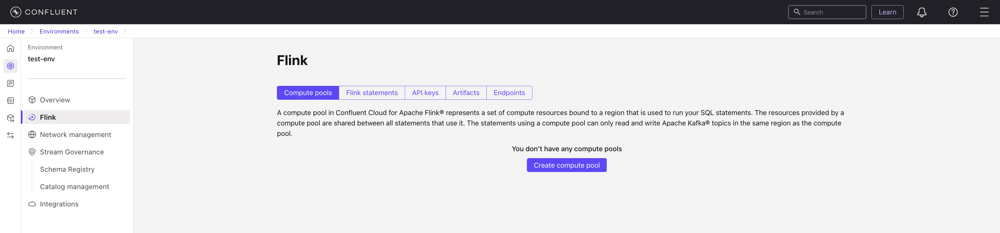

3. Select the **same region** as your Kafka cluster and click **Continue** to create the Flink Compute Pool.
4. Wait for **2–3 minutes** until the compute pool is fully provisioned.
5. Once the compute pool is ready, click on **“Open SQL Workspace”**.

   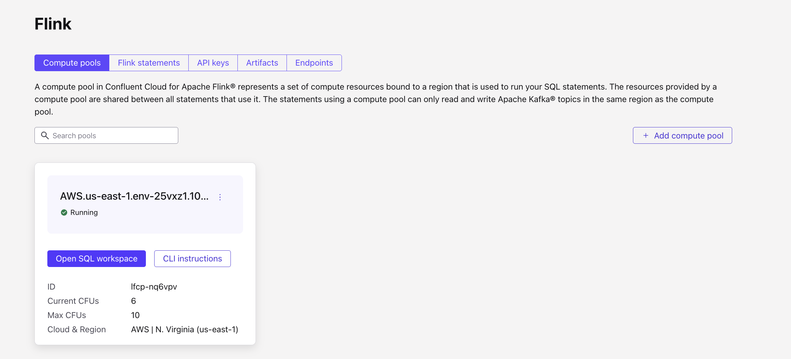

6. In the SQL workspace:
   - Ensure that the **correct Kafka cluster** is selected from the database dropdown.
   - You can now start executing your Flink SQL queries.

   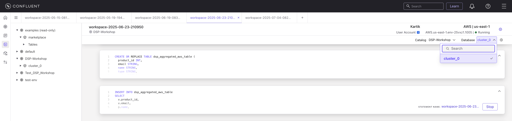


#### Trending Products Table

```sql
CREATE TABLE datagen_trending_products (
  product_id STRING,
  view_count BIGINT,
  PRIMARY KEY (product_id) NOT ENFORCED
) WITH (
  'changelog.mode' = 'upsert',
  'value.format' = 'json-registry',
  'key.format' = 'json-registry'
);
```
```sql
INSERT INTO datagen_trending_products
SELECT
  CAST(product_id AS STRING) AS product_id,
  COUNT(*) AS view_count
FROM datagen_product_view
GROUP BY product_id;
```

#### Aggregated AWS Table

```sql
CREATE OR REPLACE TABLE dsp_aggregated_aws_table (
  product_id INT,
  email STRING,
  name STRING,
  type STRING,
  price DOUBLE,
  quantity INT,
  PRIMARY KEY (product_id) NOT ENFORCED
) WITH (
  'changelog.mode' = 'append',
  'key.format' = 'json-registry',
  'value.format' = 'json-registry'
);
```
```sql
INSERT INTO dsp_aggregated_aws_table
SELECT
  v.product_id,
  v.email,
  p.name,
  p.type,
  p.price,
  p.quantity
FROM datagen_product_view v
JOIN dsp_public_products p
  ON v.product_id = p.id
WHERE p.__deleted = 'false';
```

#### Cart with Email Table

```sql
CREATE TABLE cart_with_email (
  email STRING,
  product_id STRING,
  product_name STRING,
  product_type STRING,
  PRIMARY KEY (email, product_id) NOT ENFORCED
) WITH (
  'changelog.mode' = 'upsert',
  'key.format' = 'json-registry',
  'value.format' = 'json-registry'
);
```
```sql
INSERT INTO cart_with_email
SELECT
  cu.email,
  CAST(c.product_id AS STRING) AS product_id,
  p.name AS product_name,
  p.type AS product_type
FROM dsp_public_cart c
JOIN dsp_public_users cu ON c.user_id = cu.id
JOIN dsp_public_products p ON c.product_id = p.id
WHERE c.__deleted = 'false'
  AND cu.__deleted = 'false'
  AND p.__deleted = 'false';
```

#### Personalized Suggestions Table

```sql
CREATE TABLE personalized_suggestions (
  user_email STRING,
  suggested_products ARRAY<INT>,
  PRIMARY KEY (user_email) NOT ENFORCED
) WITH (
  'key.format' = 'json-registry',
  'value.format' = 'json-registry',
  'changelog.mode' = 'upsert'
);
```
```sql
INSERT INTO personalized_suggestions
SELECT
  user_email,
  ARRAY_AGG(DISTINCT CAST(suggested_product_id AS INT)) AS suggested_products
FROM (
  -- Include product from cart
  SELECT
    cu.email AS user_email,
    CAST(p.id AS STRING) AS suggested_product_id,
    p.type,
    ROW_NUMBER() OVER (PARTITION BY cu.email, p.type ORDER BY p.price DESC) AS rnk
  FROM dsp_public_cart c
  JOIN dsp_public_users cu ON cu.id = c.user_id
  JOIN dsp_public_products p ON p.id = c.product_id
  WHERE c.__deleted = 'false'
    AND cu.__deleted = 'false'
    AND p.__deleted = 'false'

  UNION ALL

  -- Include cheaper products of the same type
  SELECT
    cu.email AS user_email,
    CAST(sp.id AS STRING) AS suggested_product_id,
    sp.type,
    ROW_NUMBER() OVER (PARTITION BY cu.email, sp.type ORDER BY sp.price ASC) AS rnk
  FROM dsp_public_cart c
  JOIN dsp_public_users cu ON cu.id = c.user_id
  JOIN dsp_public_products p ON p.id = c.product_id
  JOIN dsp_public_products sp ON sp.type = p.type AND sp.price < p.price
  WHERE c.__deleted = 'false'
    AND cu.__deleted = 'false'
    AND p.__deleted = 'false'
    AND sp.__deleted = 'false'
) suggestions
WHERE rnk <= 2
GROUP BY user_email;
```

---

## 11. Enable Tableflow Integration

### Steps to Add Provider Integrations for AWS S3 and Glue

1. Go to the **Tableflow** section in Confluent Cloud.  
2. Click on **"Go To Provider Integration"**.
   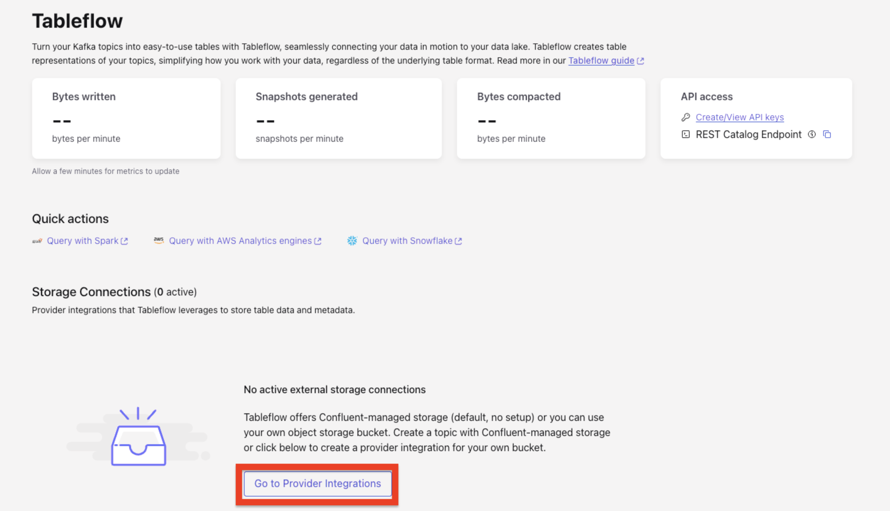
   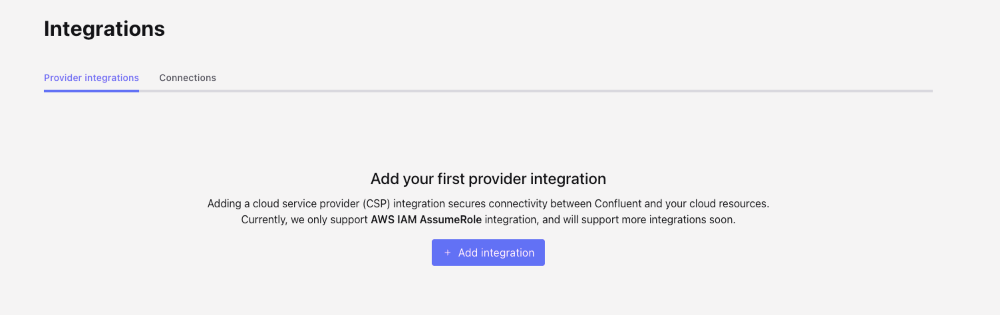 
3. Click on **"Add Integrations"**.  
4. Select **New Role** while adding the integration.

5. Select **"Tableflow S3 Bucket"** in Confluent resource and **copy the permission policy JSON**.
 
6. Go to the **AWS Console** and **create a policy** using that JSON file. While creating the policy, update the **bucket name** in the permission policy JSON. Once done, click **Continue**.
```
IAM Console → Policies → Create Policy → (Visual Editor / JSON) : Update Bucket Names in JSON at 2 Places → Review & Create  
```
7. In the **AWS Console**, **create a Role** using the **trust-policy JSON** provided by Confluent Cloud UI and **attach the policy** created in step 6 to that role. 
```
IAM Console → Roles → Create Role → Select Trusted Entity → Attach Policie Created in Last Step → Review & Create
``` 
8. Copy the **ARN** for that role from the AWS Console and paste it in Confluent Cloud to **map the role**.  
9. Provide an **integration name** and click **Continue**.  
10. You will get a **new trust policy JSON**. Go back to the AWS Console and **update the trust policy** in the role under the **Trust Relationships** tab.  
11. Click **Continue** and the integration will be added to your Tableflow.  
12. Follow the **same steps (2–11)** for the **"Tableflow Glue Catalog Sync"** integration.
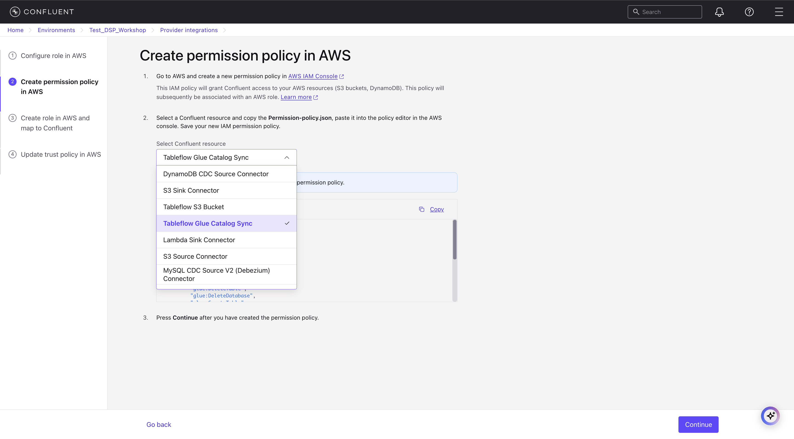 
> _(Note: Update the **region** and **AWS account ID** while creating the policy for Glue.)_

---

### Steps to Enable Tableflow for Topic

13. Go to the `dsp_aggregated_aws_table` topic and click on **"Enable Tableflow"**.
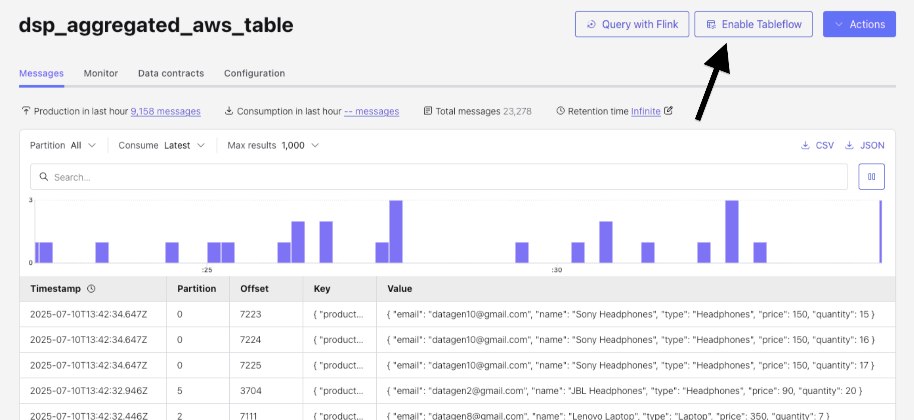
14. Select **Iceberg** and click on **"Configure Custom Storage"**.
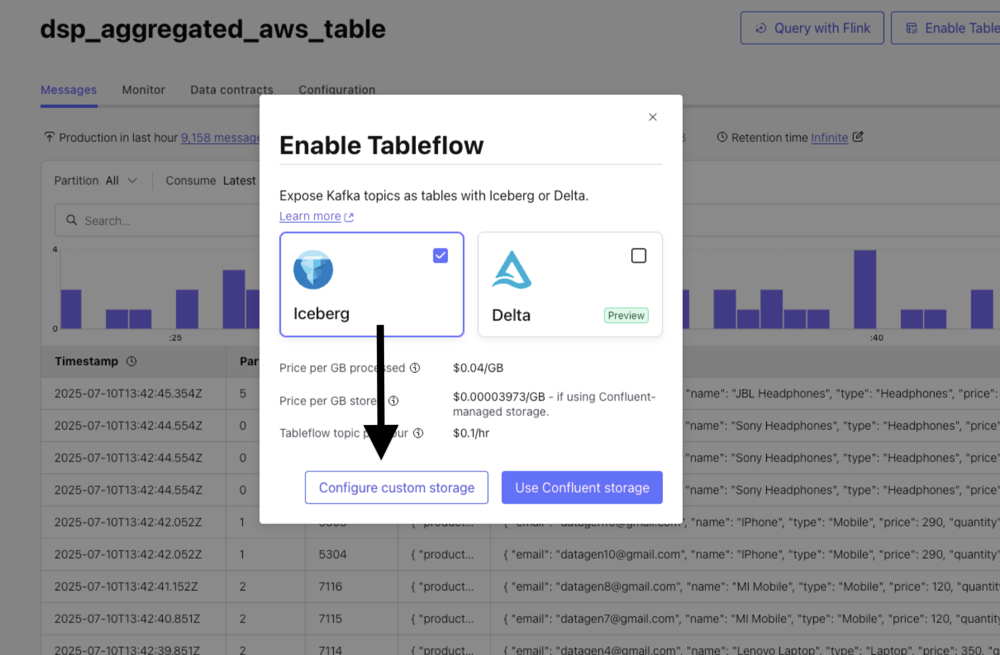 
15. Select the **"dsp_workshop_s3_integration"** created in the previous steps and enter your **S3 bucket name**.
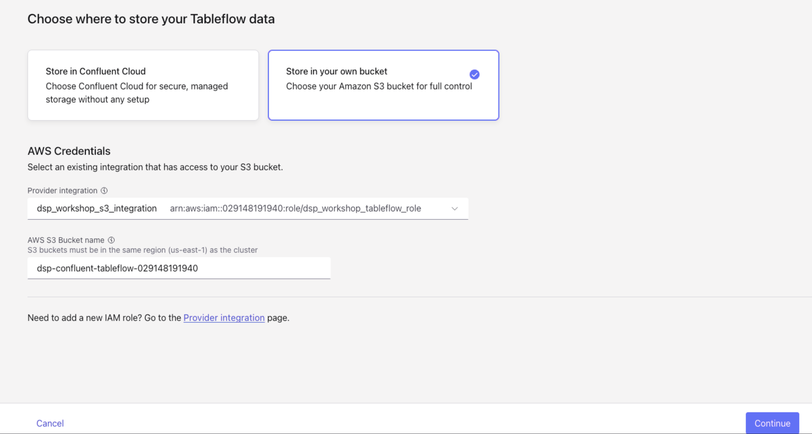  
16. Click **Continue**, review the details, and click **Launch**.

---

### Steps for Glue Integration
Now, create the Catalog Integration and link it to the Glue Provider Integration you just finished setting up.

-  In your **Confluent Cloud** console, navigate to your Environment -> **Tableflow**.
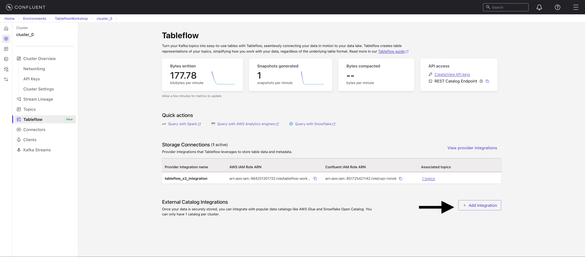
-  Scroll down to the **External Catalog Integration** section.
-  Click **+ Add Integration**.
-  For the integration type, select **AWS Glue** as the catalog.
-  Provide a **Name** for this catalog integration instance, for example, `my-glue-catalog-integration`.
-  In the section asking for the provider integration, **select the existing Glue Provider Integration** you created in the previous steps (e.g., `glue-provider-integration`) from the dropdown or list.
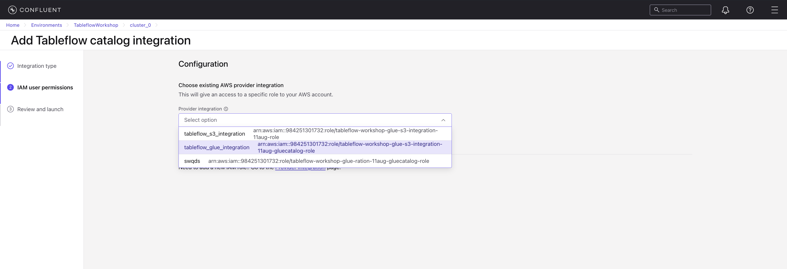
-  Review the overall configuration for the AWS Glue Catalog Integration.
-  Click **Launch** (or Continue/Create).

### Verification (Glue Catalog)
- Monitor the status of the Catalog Integration (my-glue-catalog-integration) in the Confluent Cloud Tableflow UI. It should transition to Connected or Running.

- Navigate to the AWS Glue Data Catalog service in your AWS Console.
- Look for a new Database named after your Confluent Cloud Kafka Cluster ID (e.g., lkc-xxxxxx).
- Inside that database, you should start seeing Tables appearing with names corresponding to the Kafka topics you enabled Tableflow for in Lab 3 (e.g., clicks, orders).
- It might take a few minutes for the initial sync and table creation to occur.

## 12. Explore the Stream Lineage
In Confluent Cloud, Stream Lineage is a visual tool that provides an end-to-end view of how data flows through your Kafka environment, showing the relationships between producers, topics, stream processing applications, connectors, and consumers. It automatically maps the movement and transformation of data, enabling you to trace its origin, understand dependencies, and see where it’s headed. This helps with troubleshooting, impact analysis, and governance by making it easy to identify upstream and downstream systems, track changes, and ensure data is delivered as intended - all without manually building diagrams.

To explore Stream Lineage in Confluent Cloud, navigate to:
Environment → Cluster → Stream Lineage.
Here, you’ll see an interactive map of your data pipelines, allowing you to click on topics, connectors, and stream processing jobs to trace data flow, check dependencies, and investigate transformations in real time.


## 13. Explore the application

[Open Application in Browser](http://127.0.0.1:8000)

1. **Login** to the application by entering your **name** and **email**.
2. Navigate to the **Product Page** to view the latest trends in trending products and suggestions.

- Trending proudcts will be visible in UI on the basis of Views.
- Suggestion will be visible in UI on the based of items added into cart and lower prices products which you are adding to the cart.
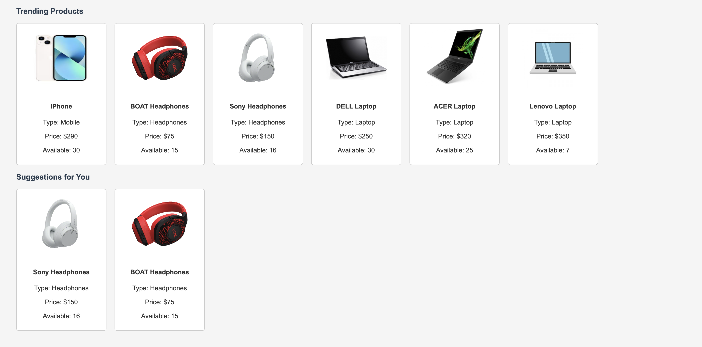
3. Click on **Analytics** to explore the analytics data.

> If you're logging in again using the same browser, **clear your browser cache** to avoid stale data issues.

