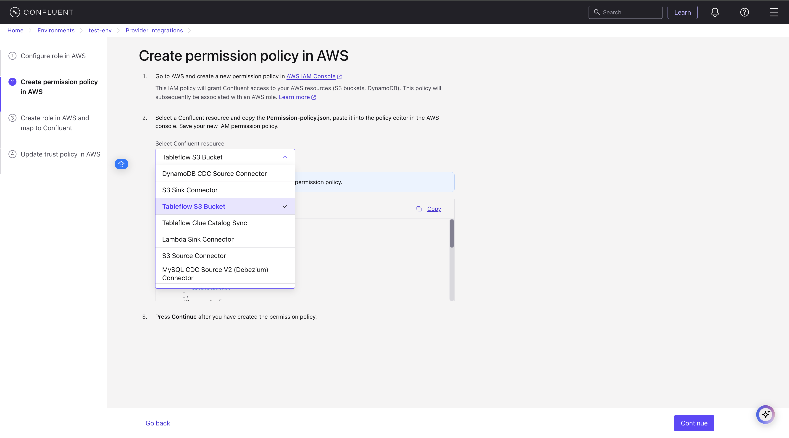
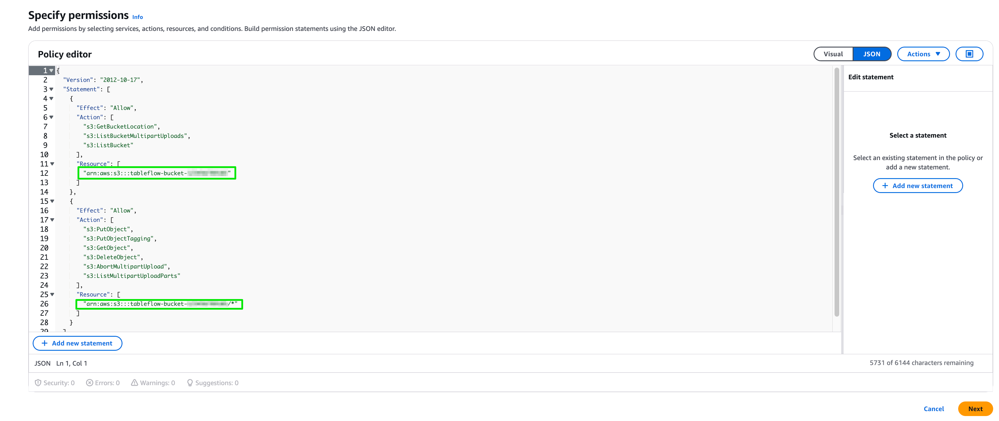
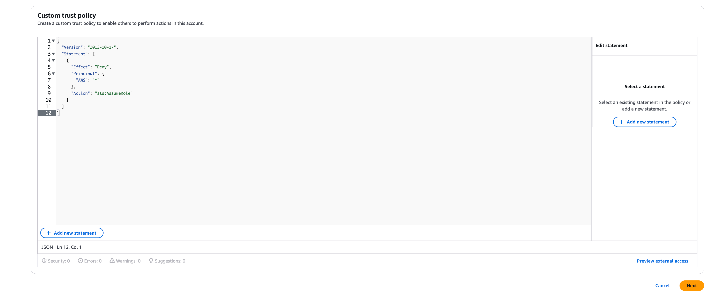
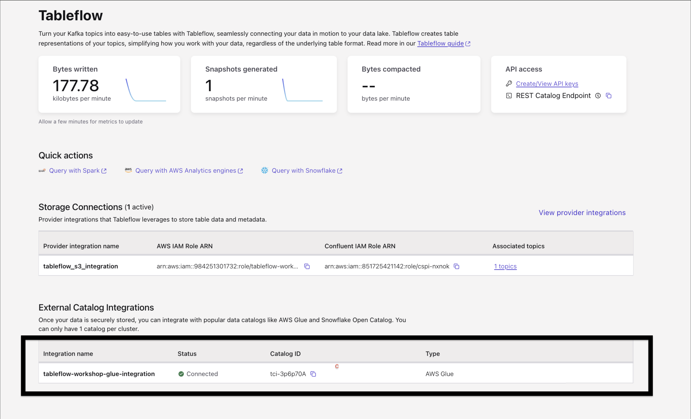
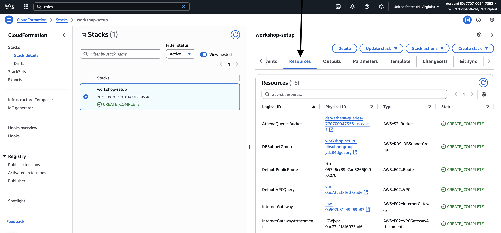
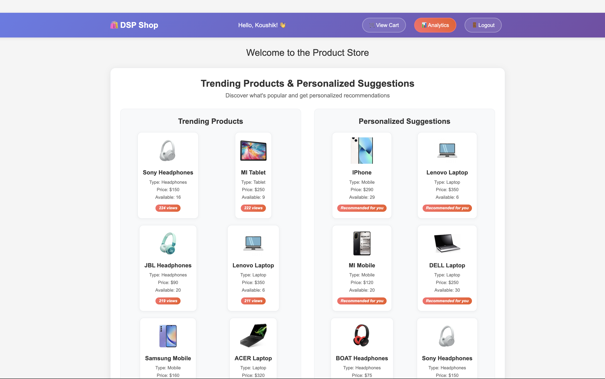

<<<<<<< HEAD
=======
<p align="center">
  
</p>

<h1 align="center">Real-Time Data Streaming Application</h1>


## Agenda

1. [Clone the Repository](#1-clone-the-repository)
2. [Set Up Python Environment](#2-set-up-python-environment)
3. [Install Required Packages](#3-install-required-packages)
4. [Sign Up to Confluent Cloud](#4-sign-up-to-confluent-cloud)
5. [Create Confluent Cloud Environment, Cluster and API Keys](#5-create-confluent-cloud-environment-cluster-and-api-keys)
6. [Flink Setup](#6-flink-setup)
7. [Enable Tableflow Integration](#7-enable-tableflow-integration)
8. [Create or Update Properties Files](#8-create-or-update-properties-files)
9. [Run the Application](#9-run-the-application)
10. [Set Up Connectors](#10-set-up-connectors)
11. [Run Flink Queries](#11-run-flink-queries)
12. [Explore the Stream Lineage](#12-explore-the-stream-lineage)
13. [Explore the Application](#13-explore-the-application)
14. [Clean Up Resources After the Workshop](#14-clean-up-resources-after-the-workshop)

>>>>>>> PLGCEE-322
## Objective

This project demonstrates how to build a **real-time data streaming application** powered by **Confluent Cloud**, leveraging its fully managed Kafka platform, Flink SQL-based stream processing and Tableflow integration capabilities. 

This application powers real-time personalization and analytics for an e-commerce platform. It displays trending products based on live view counts, offers personalized suggestions by analyzing cart activity and recommending similar or lower-priced items, and provides an analytics dashboard with metrics like views, cart additions, and conversion rates. A streaming data pipeline ensures the UI and analytics stay updated instantly with user behavior.

<<<<<<< HEAD

=======
<p align="center">
  
</p>
>>>>>>> PLGCEE-322

### The solution uses several key services from **Confluent Cloud**:

- **Kafka (Fully Managed)** – Reliable real-time messaging backbone for event-driven architecture
- **Debezium PostgreSQL CDC Connector** – Captures real-time database changes and streams them into Kafka
- **Datagen Connector** – Simulates product view events for testing and demos
- **Flink SQL** – Real-time processing and enrichment of data using SQL with minimal setup
- **Tableflow** – Streams enriched data from Kafka into **AWS S3 (Iceberg format)** and **Glue Catalog**, enabling analytics

### Key Use Cases Demonstrated

- Capture and stream data changes from PostgreSQL to Kafka in real time
- Generate synthetic events for simulating product views
- Use **Flink SQL** to build:
  - Trending products
  - Personalized recommendations
  - Enriched cart data
  - Analytics 
- Persist enriched streaming output to AWS S3 using **Confluent Tableflow**
- Sync metadata with **AWS Glue Catalog** for downstream querying

This project is ideal for developers, architects, and data engineers who want to:

- Learn how to build a **real-time pipeline using Confluent Cloud**
- Explore **stream processing** with **Flink SQL**
- See how **Tableflow** can seamlessly bridge Kafka and the data lake

All components are fully managed via Confluent Cloud, ensuring fast setup and minimal operational overhead.

## Prerequisites
Before you begin, ensure you have the following installed on your system:
<<<<<<< HEAD
- **Python 3** (latest stable version recommended)
- **AWS CLI** (configured with appropriate credentials and region)

<div style="border: 6px solid #555; padding: 16px; border-radius: 8px; margin: 16px 0;">
<details> 
<summary><strong>Steps for AWS Setup</strong></summary>
<br>

=======
- **Python 3** (version 3.12 recommended) – [Download Python 3.12 here](https://www.python.org/downloads/release/python-3129/)

<div style="border: 6px solid #555; padding: 16px; border-radius: 8px; margin: 16px 0;">
<details> 
<summary><strong><em>👈 Steps for AWS Setup (Click to Expand)</em></strong></summary>
<br>

⚠️  Refer to the document here: [Steps to launch AWS Workspace and Get AWS Creds](https://docs.google.com/document/d/1eD0aB5W6TsAC2J77_KvBNIsTBZ7Ak7ZhOKWb_r2zzBA/edit?tab=t.0)

>>>>>>> PLGCEE-322
If you are using AWS Workshpace provided by Confluent, the CloudFormation stack `workshop-prep-stack` has already been deployed for you.

## Retrieve Stack Outputs

Once you launch the AWS Workspace studio provided by Confluent, 
1. Click on Open AWS Console


2. After opening the AWS Console, Search for Cloudformation in Search bar and Open Cloudformation workspace.


3. Open workshop-setup stack 


4. Open Output tab to access the details for updating .properties file


## Optional: For Personal AWS Account Users

If you're not using AWS Workshop Studio, you can deploy the CloudFormation stack manually in your account and follow the same steps above to extract values and update the files.

or

follow these instructions to manually create the required AWS resources in your own account.

### Step 1: Create a DB Parameter Group

Go to AWS Console > RDS > Parameter groups  
Click Create parameter group  
Parameter group family: postgres17  
Group name: dsp-pg-logical-replication  
Description: Enable logical replication

After creating, click the new group to Edit parameters.  
Find `rds.logical_replication`, set it to `1`, then click Save changes

:warning: If you're using a different PostgreSQL version (e.g., 15), choose the matching parameter group family like postgres15.

### Step 2: Create an RDS PostgreSQL Instance

Go to AWS Console > RDS > Databases > Create Database

Choose:

- Engine: PostgreSQL  
- Version: 17.5 (or latest available)  
- Template: Free tier (if applicable)  
- DB Instance Identifier: dsp-postgres-db  
- Master username: dspadmin  
- Master password: YourSecurePassword123! (or a strong password)  
- DB Name: dspdb  
- DB instance size: db.t3.micro or similar  
- Storage: 40 GiB  
- Enable Public access  
- VPC Security Group: create or select one that allows inbound access on port 5432 from your IP or 0.0.0.0/0 (:warning: public — for workshop use only)

In Additional configurations:  
Set parameter group with `rds.logical_replication = 1`  
If not available, create one under RDS > Parameter Groups.

Wait for the instance to be available, and note: Endpoint (host), Port, DB name, Username and Password  

### Create Two S3 Buckets

In S3 Console, create two buckets:

- Bucket 1: Athena Queries  
  Name: `dsp-athena-queries-<your-aws-account-id>`  
  Region: same as your RDS instance  
  Default settings are fine

- Bucket 2: Tableflow  
  Name: `dsp-confluent-tableflow-<your-aws-account-id>`  
  Region: same

Once your resources are ready, use their values in the `psqlclient.properties` and `aws.properties` files.
</details>
</div>

## Application Setup Instructions


<<<<<<< HEAD
### 1. Clone the Repository

```bash
git clone <your-repo-url>
cd <repo-name>/app
=======
## 1. Clone the Repository

```bash
git clone https://github.com/confluentinc/confluent-workshops.git
cd confluent-workshops/workshop/dsp-workshop
>>>>>>> PLGCEE-322
```

### 2. Set Up Python Environment

```bash
<<<<<<< HEAD
cd dsp-workshop
```
```bash
=======
>>>>>>> PLGCEE-322
python3 -m venv venv
```
```bash
source venv/bin/activate
```

### 3. Install Required Packages

```bash
<<<<<<< HEAD
pip3 install fastapi uvicorn jinja2 sqlalchemy psycopg2-binary confluent-kafka python-multipart boto3 pandas plotly
```

---

## Confluent Cloud Setup

### 4. Sign UP to Confluent Cloud
=======
pip install -r requirements.txt
```


## Confluent Cloud Setup

## 4. Sign UP to Confluent Cloud
>>>>>>> PLGCEE-322

To get started, you'll need an active **Confluent Cloud** account.

1. **Sign up** for a free account: [Confluent Cloud Signup](https://confluent.cloud)
2. Once logged in, click the **menu icon (top-right)** → go to **Billing & payment**
3. Under **"Payment details & contacts"**, enter your **billing information**

Note : When you sign up for a Confluent Cloud account, you will get free credits to use in Confluent Cloud. This will cover the cost of resources created during the workshop.

<<<<<<< HEAD
### 5. Create Infrastructure
=======
## 5. Create Confluent Cloud Environment, Cluster and API Keys
>>>>>>> PLGCEE-322

1. Create a new **Environment** in [Confluent Cloud](https://confluent.cloud)
   
2. Create a **Standard Kafka Cluster** in your nearest region
   
3. Generate **API Keys** and update the values in `client.properties`
#### Steps to Create API Keys
- Go to the **API Keys** section.
- Select **"My Account"** for generating the API keys.
   
- Download the **API Key** and **Secret**, to update them in your `client.properties` file (All required values will be present in client.properties).
   

<<<<<<< HEAD
---

## Configuration

### 6. Update Property Files

Edit the following files and update them with your credentials, these files are present in `app` folder with `.properties` extension.

* Update `psqlclient.properties`

```
# PostgreSQL
postgres.user=<RDSUsername>
postgres.password=<RDSPassword>
postgres.host=<RDSInstanceEndpoint>
postgres.db=<RDSDatabaseName>
```
Replace the values above with the ones returned by your describe-stacks output from AWS

* Update `aws.properties` (For AWS Secret ID and Key, generate IAM user with admin permissions and update in aws.properties file)

```
aws.region=<Your AWS Region>
aws.access_key_id=<Your AWS ACCESS KEY>
aws.secret_access_key=<Your SECRET AWS ACCESS KEY>
athena.output_location=s3://<AthenaBucketName>/
athena.database=<your_confluent_cluster_id>         
athena.table=<your_confluent_topic_name>         
```
Replace the values above with the ones returned by your describe-stacks output from AWS 

* Update `client.properties` – Use API Keys and Bootstrap server details created in step-5. File which has been downloaded contains all the details to update client.properties

---

## Run the Application

### 7. Start FastAPI Server

```bash
uvicorn main:app --reload
=======
## 6. Flink Setup

### Create Flink Compute Pool and Create Table

Use Flink SQL to perform real-time analytics and transformations on your Kafka topics.

### Steps to Create Flink Compute Pool

1. Go to your **Confluent Cloud environment** and open the **Flink** tab.
2. Click on **“Create Compute Pool”**.

   

3. Select the **same region** as your Kafka cluster and click **Continue** to create the Flink Compute Pool.
   > **Important:** Flink is **not available in all regions**. To avoid any issues, **select the same region as your Kafka cluster**. If possible, use **`us-east-1`**, which is guaranteed to have Flink.  
   > ⚠️ Using a region where Flink is unavailable will require you to start the setup from scratch.
4. Wait for **2–3 minutes** until the compute pool is fully provisioned.
5. Once the compute pool is ready, click on **“Open SQL Workspace”**.

   

6. In the SQL workspace:
   - Ensure that the **correct Kafka cluster** is selected from the database dropdown.
   - You can now start executing your Flink SQL queries.

   

#### Aggregated AWS Table

```sql
CREATE OR REPLACE TABLE dsp_aggregated_aws_table (
  product_id INT,
  email STRING,
  name STRING,
  type STRING,
  price DOUBLE,
  quantity INT,
  PRIMARY KEY (product_id) NOT ENFORCED
) WITH (
  'changelog.mode' = 'append',
  'key.format' = 'json-registry',
  'value.format' = 'json-registry'
);
```
```sql
INSERT INTO dsp_aggregated_aws_table (product_id, email, name, type, price, quantity)
VALUES (1, 'datagen1@gmail.com', 'Samsung Mobile', 'Mobile', 160.0, 18);
```

## 7. Enable Tableflow Integration

### 👉 Steps to Add Provider Integrations for AWS S3

### Step 1: Configure Storage Provider Integration (Confluent Cloud)

Now, let's start the process in Confluent Cloud to connect to the S3 bucket.

1.  Navigate back to your **Confluent Cloud** console.
2.  Within your Environment's Cluster, click on **Tableflow** in the left-hand menu.
3.  In the center of the Tableflow page, find the option related to storage connections and click **Go to Provider Integrations**. *(Note: UI text might vary slightly)*.
4.  Click **+ Add Integration**.

 
5.  Choose to **create a new role** when prompted and click **Continue**.

6.  On the "Create Permission Policy in AWS" screen, ensure **Tableflow S3 Bucket** is selected (or similar option representing S3 access).

7.  **IMPORTANT:** Confluent Cloud will display a JSON permissions policy. **Copy this `permissions-policy.json`**. You will need it in the next step to create the IAM policy in AWS. Keep this Confluent Cloud wizard page open.


### Step 2: Create a New Permissions Policy on AWS

Use the policy JSON copied from Confluent Cloud to create an IAM policy in AWS that grants the necessary S3 permissions.

1.  In a new browser tab or window, go to the **IAM** service in your AWS Management Console.
2.  Click **Policies** in the left navigation pane.
3.  Click **Create Policy**.
4.  Select the **JSON** tab.
5.  Paste the `permissions-policy.json` you copied from the Confluent Cloud wizard into the JSON editor.
6.  **CRITICAL:** Find the `Resource` sections in the JSON policy and replace the placeholder bucket names (e.g., `tableflow-bucket-123456789101` in the document example) with your *actual* S3 bucket name created in Step 1 (e.g., `tableflow-bucket-<<Account-ID>>`). Make sure to update it in both places (e.g., `arn:aws:s3:::your-bucket-name` and `arn:aws:s3:::your-bucket-name/*`).

    ```json
    // Example structure from the document - ensure your bucket name is correct
    {
        "Version": "2012-10-17",
        "Statement": [
            {
                "Effect": "Allow",
                "Action": [
                    "s3:GetBucketLocation",
                    "s3:ListBucketMultipartUploads",
                    "s3:ListBucket"
                ],
                "Resource": [
                    "arn:aws:s3:::<<Your S3 Bucket Name>>" // Replace placeholder
                ]
            },
            {
                "Effect": "Allow",
                "Action": [
                    "s3:PutObject",
                    "s3:PutObjectTagging", // May differ slightly based on wizard version
                    "s3:GetObject",
                    "s3:DeleteObject",
                    "s3:AbortMultipartUpload",
                    "s3:ListMultipartUploadParts"
                ],
                "Resource": [
                    "arn:aws:s3:::<<Your S3 Bucket Name>>/*" // Replace placeholder
                ]
            }
        ]
    }
    ```



7.  Click **Next** (or Next: Tags -> Next: Review).
8.  Give the policy a descriptive **Name**, like `tableflow-s3-access-policy`.
9.  Click **Create Policy**.
10. Return to the **Confluent Cloud** provider integration wizard and click **Continue**.


### Step 3: Create Role in AWS and Map to Confluent (Initial Steps)

Now, create the IAM role in AWS that Confluent Cloud will assume, using a trust policy provided by Confluent.

1.  The Confluent Cloud wizard should now display a **`trust-policy.json`** on the "Create role in AWS and map to Confluent" page. **Copy this `trust-policy.json`**. Keep the Confluent wizard open.
2.  In AWS, navigate back to the **IAM** service -> **Roles**.
3.  Click **Create role**.
4.  Select **Custom trust policy** as the trusted entity type.
5.  Paste the `trust-policy.json` you copied from Confluent Cloud into the JSON editor.



6.  Click **Next**.
7.  On the **Add permissions** page, search for and select the IAM policy you created in Step 3 (e.g., `tableflow-s3-access-policy`).
8.  Click **Next**.
9.  Enter a **Role name** (e.g., `quickstart-tableflow-assume-role`).
10. Scroll down and click **Create role**.
11. After the role is created, click **View Role** (or find it in the list and click its name).
12. **IMPORTANT:** Find and copy the **ARN** (Amazon Resource Name) of the role you just created. It will look like `arn:aws:iam::<<Your AWS Account ID>>:role/<<Your Role Name>>`.


### Step 4: Complete Provider Integration (Confluent Cloud & AWS)

Finally, provide the Role ARN to Confluent Cloud and update the role's trust policy in AWS with the External ID from Confluent.

1.  Return to the **Confluent Cloud** Provider Integration wizard page.
2.  Paste the **AWS Role ARN** you just copied into the appropriate field ("AWS ARN " or similar).
3.  Give the Provider Integration a **Name** (e.g., `s3-provider-integration`).
4.  Click **Continue**.
5.  **IMPORTANT:** Confluent Cloud will now display an **updated Trust Policy JSON**, which includes a unique `sts:ExternalId`. **Copy this entire updated `trust-policy.json`**.


6.  Go back to the **AWS IAM Role** you created (e.g., `quickstart-tableflow-assume-role`).
7.  Select the **Trust relationships** tab.
8.  Click **Edit trust policy** (or Edit trust relationship).
9.  **Replace the entire existing JSON** with the updated `trust-policy.json` you copied from Confluent Cloud in the previous step. This adds the necessary External ID condition.
10. Click **Update policy** (or Save changes).
11. Return to the **Confluent Cloud** wizard one last time and click **Continue** (or Finish/Create).

### 👉 Steps to Enable Tableflow on Your Kafka Topic - `dsp_aggregated_aws_table`

### Step 5: Enable Tableflow on Your Kafka Topic

With the Provider Integration successfully configured, you can now enable Tableflow for your desired Kafka topics.

1.  **Navigate to Topics:**
    * In your Confluent Cloud console, go to your Environment, then select your Kafka Cluster.
    * In the left-hand navigation menu for your cluster, click on **Topics**. You should see a list of your topics.

2.  **Enable Tableflow for `dsp_aggregated_aws_table` topic:**
    * Find the specific topic you want to enable Tableflow for in the list.
    * On the right-hand side of the row for that topic, in the "Tableflow" column, click the **Enable Tableflow** button/link.


3.  **Configure Storage:**
    * You will be asked to choose storage. Select **Configure custom storage**.
    
    * In the next menu, choose the **Provider Integration** you just created in Steps 2-5 (e.g., `s3-provider-integration`). You can identify it by the integration name or the IAM Role ARN.
    * Enter your **AWS S3 bucket name** (e.g., `tableflow-bucket-<<account-id>>`) where the Iceberg data should be written.

 

4.  **Launch Tableflow Sync:**
    * Review the configuration details on the final screen.
    * Click **Launch**.

5.  **Monitor Status:**
    * Back on the Topics page, you will see the status for that topic change under the Tableflow column, first to `Tableflow sync pending` and then shortly after to `Syncing`.


### 👉 Steps to Enable Glue Integration

### Step 6: Enable Glue Integration - Navigate to Provider Integrations

1.  In your **Confluent Cloud** console, navigate to your Cluster: Environment > Your Environment > Your Cluster
2.  Click on **Tableflow** in the left-hand menu.
3.  Click on ** View provider Integrations**.

    


### Step 7: Start Creating the *New* Provider Integration for Glue

**Important:** This creates a *separate* IAM Role and Provider Integration specifically for allowing Confluent Cloud to interact with your AWS Glue Data Catalog. It is *different* from the `s3-provider-integration` role used for writing data to S3.

1.  In the Provider Integrations section, click **+ Add Integration**.
2.  Choose to **create a new role** when prompted and click **Continue**.
3.  On the "Create Permission Policy in AWS" screen, ensure the Confluent Resource selected is **Tableflow Glue Catalog sync** (or similar wording indicating Glue access, *not* S3 access).
4.  **IMPORTANT:** Confluent Cloud will display a JSON permissions policy specifically for Glue access. **Copy this `permissions-policy.json`**. You will need it in the next step. Keep this Confluent Cloud wizard page open.


### Step 8: Create AWS IAM Policy for Glue Access

Use the policy JSON copied from the *Glue* wizard step to create an IAM policy in AWS.

1.  In your **AWS Management Console**, navigate to the **IAM** service.
2.  Click **Policies** -> **Create Policy**.
3.  Select the **JSON** tab.
4.  Paste the `permissions-policy.json` you copied in the previous step (specific to Glue access). *This policy grants permissions like `glue:GetDatabase`, `glue:CreateTable`, `glue:UpdateTable`, etc.*
5. Ensure you modify the Resource block to input your region (e.g. `us-east-2`) and account number.


6.  Click **Next** (or Next: Tags -> Next: Review).
7.  Give the policy a descriptive **Name**, like `tableflow-glue-access-policy`.
8.  Click **Create Policy**.
9.  Return to the **Confluent Cloud** provider integration wizard and click **Continue**.


### Step 9: Create AWS IAM Role for Glue Access (Initial)

Create a new IAM role in AWS that Confluent Cloud will assume *specifically for Glue access*.

1.  The Confluent Cloud wizard (for the Glue Provider Integration) should now display a **`trust-policy.json`** on the "Create role in AWS and map to Confluent" page. **Copy this `trust-policy.json`**. Keep the wizard open.
2.  In **AWS IAM**, navigate to **Roles** -> **Create role**.
3.  Select **Custom trust policy**.
4.  Paste the `trust-policy.json` you copied from the *Glue* Provider Integration wizard into the JSON editor.
5.  Click **Next**.
6.  On the **Add permissions** page, search for and select the IAM policy you created specifically for Glue access in Step 3 (e.g., `tableflow-glue-access-policy`).
7.  Click **Next**.
8.  Enter a **Role name** (distinct from your S3 role), e.g., `quickstart-tableflow-glue-assume-role`.
9.  Scroll down and click **Create role**.
10. After the role is created, view the role details and **copy its ARN**.


### Step 10: Complete Glue Provider Integration (Confluent & AWS)

Link the new Glue IAM role back to Confluent Cloud within the Provider Integration wizard.

1.  Return to the **Confluent Cloud** wizard for the Glue Provider Integration.
2.  Paste the **AWS Role ARN** for the *Glue access role* (copied in the previous step) into the appropriate field.
3.  Give this Glue-specific **Provider Integration** a **Name** (e.g., `glue-provider-integration`). Make a note of this name.
4.  Click **Continue**.
5.  **IMPORTANT:** Confluent Cloud will display an **updated Trust Policy JSON** (with the External ID) for the *Glue access role*. **Copy this entire updated `trust-policy.json`**.
6.  Go back to the **AWS IAM Role** you created specifically for Glue access (e.g., `quickstart-tableflow-glue-assume-role`).
7.  Select the **Trust relationships** tab and click **Edit trust policy**.
8.  **Replace the entire existing JSON** with the updated `trust-policy.json` (containing the External ID) you copied from Confluent Cloud.
9.  Click **Update policy**.
10. Return to the **Confluent Cloud** wizard and click **Continue** (or Finish/Create) to complete the Glue Provider Integration setup. You should now see `glue-provider-integration` listed in your Provider Integrations.

### Step 11: Create Catalog Integration

Now, create the Catalog Integration and link it to the Glue Provider Integration you just finished setting up.

1.  In your **Confluent Cloud** console, navigate to your Environment -> **Tableflow**.
2.  Scroll down to the **External Catalog Integration** section.

3.  Click **+ Add Integration**.
4.  For the integration type, select **AWS Glue** as the catalog.
5.  Provide a **Name** for this catalog integration instance, for example, `my-glue-catalog-integration`.
6.  In the section asking for the provider integration, **select the existing Glue Provider Integration** you created in the previous steps (e.g., `glue-provider-integration`) from the dropdown or list.

7.  Review the overall configuration for the AWS Glue Catalog Integration.
8.  Click **Launch** (or Continue/Create).


### Step 12: Verification (Glue Catalog)

1.  Monitor the status of the **Catalog Integration** (`my-glue-catalog-integration`) in the Confluent Cloud Tableflow UI. It should transition to **Connected** or **Running**.
2.  Navigate to the **AWS Glue Data Catalog** service in your AWS Console.
3.  Look for a new **Database** named after your Confluent Cloud Kafka Cluster ID (e.g., `lkc-xxxxxx`).
4.  Inside that database, you should start seeing **Tables** appearing with names corresponding to the Kafka topics.
5.  It might take a few minutes for the initial sync and table creation to occur.


## Configuration

### 8. Create or Update Properties Files

Edit the `.properties` files with your credentials which would be available in the **outputs** tab of the cloudformation stack in AWS Console.
**If a file does not exist, create it first**

* Create or Update `psqlclient.properties` file.

```
# PostgreSQL
postgres.user=dspadmin
postgres.password=<RDSPassword>
postgres.host=<RDSDatabaseName>
postgres.port=5432
postgres.db=dspdb
```
<details> 
<summary><strong><em>👈 Steps to get Postgres credentials (Click here)</em></strong></summary>
<br>

1. Go to the **Resources** tab in the CloudFormation template.  
     
   <br>

2. Scroll down and open **PostgreSQLCredentialsSecrets**.  
     
   <br>

3. Click on **Retrieve secret value** and update the credentials in `psqlclient.properties`.  
     
</details>

<br>

---

<br>

* Create or Update the `aws.properties` file with your credentials which would be available in the **outputs** tab of the cloudformation stack in AWS Console. ⚠️ [Steps to launch AWS Workspace and Get AWS Creds](https://docs.google.com/document/d/1eD0aB5W6TsAC2J77_KvBNIsTBZ7Ak7ZhOKWb_r2zzBA/edit?tab=t.0)

Get the AWS Secrets from here


```
aws.region=us-east-1
aws.access_key_id=<access_key_id>
aws.secret_access_key=<secret_access_key>
aws.session_token=<Your AWS Session Token=>
athena.output_location=s3://dsp-athena-queries-<account_id>/
athena.database=<cluster_id>
athena.table=dsp_aggregated_aws_table
```

* Create or Update `client.properties` file – Use API Keys and Bootstrap server details created in step-5. File which has been downloaded contains all the details to update client.properties

```
# Required connection configs for Kafka producer, consumer, and admin
bootstrap.servers=<Bootstart Server URL With 9092 Port>
security.protocol=SASL_SSL
sasl.mechanisms=PLAIN
sasl.username=<API Key>
sasl.password=<API Secret>

# Best practice for higher availability in librdkafka clients prior to 1.7
session.timeout.ms=45000

client.id=ccloud-python-client-60d8d045-3618-4c93-bda5-007f629600bb
```

## 9. Run the Application

### Start FastAPI Server

Before running the server, make sure you have saved all the properties file:

```bash
uvicorn app.main:app --reload
```

Wait until you see the following logs in your terminal
```bash
INFO:     Waiting for application startup.
INFO:app.main:Database tables created successfully
INFO:app.services.kafka_service:Starting consumers for trending: datagen_trending_products, suggestions: personalized_suggestions
INFO:app.services.kafka_service:Setting running flag to True
INFO:app.services.kafka_service:Creating trending consumer thread...
INFO:app.services.kafka_service:=== TRENDING CONSUMER LOOP STARTED for topic: datagen_trending_products ===
INFO:app.services.kafka_service:Trending consumer thread started: 6227832832
INFO:app.services.kafka_service:Started trending consumer for topic: datagen_trending_products
INFO:app.services.kafka_service:Creating suggestions consumer thread...
INFO:app.services.kafka_service:=== SUGGESTIONS CONSUMER LOOP STARTED for topic: personalized_suggestions ===
INFO:app.services.kafka_service:Suggestions consumer thread started: 6246952960
INFO:app.services.kafka_service:Started suggestions consumer for topic: personalized_suggestions
INFO:app.services.kafka_service:Started separate consumers for trending topic: datagen_trending_products and suggestions topic: personalized_suggestions
>>>>>>> PLGCEE-322
```

This will start the server on:
[http://127.0.0.1:8000](http://127.0.0.1:8000)

<<<<<<< HEAD
---

### 8. Add Products to Database
=======
> **Note:** At this stage, you don’t need to log in with any credentials. This step is only to ensure that the app launches successfully. You will log in properly later.

### Add Products to Database
>>>>>>> PLGCEE-322

To populate the product table with sample data, run:

* Open new tab in you terminal and go to dsp-workshop directory.
<<<<<<< HEAD
=======
```bash
cd workshop/dsp-workshop
```

>>>>>>> PLGCEE-322
* Activate the virtual environment
```bash
source venv/bin/activate
```
<<<<<<< HEAD
```bash
cd app
```
```bash
python3 add-products.py
```

---

## Explore the Application (DSP is not enabled yet)

You can now:

* Log in to the application
* View the product catalog
* Try adding products to your cart

---

## Confluent Cloud Components Setup

### 9. Set Up Connectors

---
=======

```bash
python3 app/add-products.py
```

### Explore the Application (DSP is not enabled yet)

You can now:

* Log in to the application  
  > **Note:** For this workshop, you can log in using **any name and email ID**. This is just to explore the app; proper authentication will be implemented later.  

* View the product catalog  

* Try adding products to your cart  

> **Note:** The "Trending Products" and "Suggestions for You" sections are **not yet implemented**. After adding products like "BOAT Headphones," you may see a message like "Refreshing trending products" for a while. These features will be powered by Flink in later parts of the workshop.


## Confluent Cloud Components Setup

## 10. Set Up Connectors

>>>>>>> PLGCEE-322

### CDC Source Connector (PostgreSQL)

Use the **Debezium PostgreSQL connector** to stream database changes into Kafka in real time.

### Steps to Create Postgres CDC Source V2 (Debezium) Connector

1. Go to the **Connectors** tab in Confluent Cloud and search for **"Postgres CDC Source V2 (Debezium)"**.
2. This will redirect you to the connector configuration page.
   * Select **"Use an existing API Key"** and provide the API key credentials you created earlier.
     
3. Add your **PostgreSQL connection credentials**.
   
4. Click **Continue**. This will take a few moments to initialize.
5. In the **configuration page**, set the following values:
   * **Output record value format**: `JSON_SR`
   * **Output Kafka record key format**: `JSON_SR`
   * **Topic prefix**: `dsp` (You can use your own prefix)
   * **Slot name**: `debezium` (Customizable)
   * **Publication name**: `dbz_publication` (Customizable)
     
6. Click on **"Show Advanced Configurations"**:
   * Set **After-state only** to `true`
   * Scroll down for more options
     
7. Click on **"Add SMT" (Single Message Transform)** and configure the following:
   * **Transform Type**: `TopicRegexRouter`
   * **Transformation Values**:
     * `regex: (.*)\.(.*)\.(.*)`
     * `replacement: $1_$2_$3`
       
8. Click **Continue**.
   * Keep the default **connector sizing** options.
   * Click **Continue** again.
9. Update the **Connector Name**.
10. Click **Continue** and finally click **Create** to deploy the connector.

<<<<<<< HEAD
Once deployed, you can monitor the connector status and metrics from the **Connectors** tab.

---
=======
<details>
<summary> 👈 Once your connector is deployed, you can check its status and monitor metrics to ensure it is working correctly. <strong><em>(click to expand)</strong></em></summary>

1. **Open Confluent Cloud**  
   Log in to your Confluent Cloud account and select the environment where you deployed your connector.

2. **Navigate to the Connectors tab**  
   In the left-hand menu, click on **Connectors**. This page lists all connectors in your environment.

3. **Check connector status**  
   Find your deployed connector in the list. You should see a **Status** column indicating whether the connector is:
   - **Running** ✅ – the connector is active and processing data.  
   - **Failed** ❌ – the connector encountered an error. Click on the connector name to view detailed error logs.  
   - **Paused** ⏸️ – the connector is not currently running; you can resume it if needed.

4. **View metrics**  
   Click on the connector name to open its details page. Here you can monitor:
   - **Task status** – each connector can have multiple tasks; make sure all are running.  
   - **Throughput** – messages per second being processed.  
   - **Error counts** – any recent errors or warnings.  

5. **Troubleshooting**  
   - If the connector is not running, check the **Logs** tab for error messages.  
   - Verify that the source and sink systems are accessible and credentials are correct.  
   - Retry or restart the connector from the top-right **Actions** menu if needed.

> **Tip for beginners:** Regularly monitoring your connector helps catch issues early and ensures your data pipeline is running smoothly.
</details>

>>>>>>> PLGCEE-322

### Datagen Connector

Use the **Datagen Source Connector** to simulate product view events in Kafka.

## Steps to Create Datagen Connector

1. Go to the **Connectors** tab in clusters and click on Add Connector

2. Search for **"Datagen Source"**.
   Click on **Additional Configuration**.
   
3. On the next page, create a topic named **`datagen_product_view`** with default configurations and select it for the connector.
4. Click **Continue** and select **"Use an existing API Key"**. Provide your API key credentials.
<<<<<<< HEAD
5. Choose **"Provide your own schema"** and paste the following JSON schema:
=======
5. Choose **"Provide your own schema"** and paste the schema provided below. In Output record format choose `JSON_SR`:
>>>>>>> PLGCEE-322
   
   ```json
   {
     "type": "record",
     "name": "ProductViewRecord",
     "namespace": "product_views",
     "fields": [
       {
         "name": "email",
         "type": {
           "type": "string",
           "arg.properties": {
             "options": ["datagen1@gmail.com", "datagen2@gmail.com", "datagen3@gmail.com", "datagen4@gmail.com", "datagen5@gmail.com"]
           }
         }
       },
       {
         "name": "product_id",
         "type": {
           "type": "int",
           "arg.properties": {
             "options": [1, 2, 3, 4, 5, 6, 7, 8, 9, 10]
           }
         }
       }
     ]
   }
   ```
6. Click **Continue**.
7. Keep the default **connector sizing** options.
8. Click **Continue** and Update the **Connector Name**.
9. Click **Continue**, review the settings, and **Create** the connector.

Once created, this connector will begin publishing simulated product view events to Kafka under the topic `datagen_product_view`.

<<<<<<< HEAD
---

## Flink Setup

### 10. Create Flink Compute Pool and Run Queries

Use Flink SQL to perform real-time analytics and transformations on your Kafka topics.

---

### Steps to Create Flink Compute Pool

1. Go to your **Confluent Cloud environment** and open the **Flink** tab.
2. Click on **“Create Compute Pool”**.

   

3. Select the **same region** as your Kafka cluster and click **Continue** to create the Flink Compute Pool.
4. Wait for **2–3 minutes** until the compute pool is fully provisioned.
5. Once the compute pool is ready, click on **“Open SQL Workspace”**.

   

6. In the SQL workspace:
   - Ensure that the **correct Kafka cluster** is selected from the database dropdown.
   - You can now start executing your Flink SQL queries.

   

=======

## 11. Run Flink Queries
>>>>>>> PLGCEE-322

#### Trending Products Table

```sql
CREATE TABLE datagen_trending_products (
  product_id STRING,
  view_count BIGINT,
  PRIMARY KEY (product_id) NOT ENFORCED
) WITH (
  'changelog.mode' = 'upsert',
  'value.format' = 'json-registry',
  'key.format' = 'json-registry'
);
```
```sql
<<<<<<< HEAD
=======
SET 'sql.state-ttl' = '1 HOURS';
>>>>>>> PLGCEE-322
INSERT INTO datagen_trending_products
SELECT
  CAST(product_id AS STRING) AS product_id,
  COUNT(*) AS view_count
FROM datagen_product_view
GROUP BY product_id;
```
<<<<<<< HEAD

#### Aggregated AWS Table

```sql
CREATE OR REPLACE TABLE dsp_aggregated_aws_table (
  product_id INT,
  email STRING,
  name STRING,
  type STRING,
  price DOUBLE,
  quantity INT,
  PRIMARY KEY (product_id) NOT ENFORCED
) WITH (
  'changelog.mode' = 'append',
  'key.format' = 'json-registry',
  'value.format' = 'json-registry'
);
```
```sql
=======
> **Note:** Counts how many times each product has been viewed. The app uses this table to show the **Trending Products** section to users.

```sql
SET 'sql.state-ttl' = '1 HOURS';
>>>>>>> PLGCEE-322
INSERT INTO dsp_aggregated_aws_table
SELECT
  v.product_id,
  v.email,
  p.name,
  p.type,
  p.price,
  p.quantity
FROM datagen_product_view v
JOIN dsp_public_products p
  ON v.product_id = p.id
WHERE p.__deleted = 'false';
```
<<<<<<< HEAD
=======
> **Note:** Combines product metadata with user interactions (like views or purchases). This table is mainly used for analytics and backend processing; it is not directly visible in the UI.
>>>>>>> PLGCEE-322

#### Cart with Email Table

```sql
CREATE TABLE cart_with_email (
  email STRING,
  product_id STRING,
  product_name STRING,
  product_type STRING,
  PRIMARY KEY (email, product_id) NOT ENFORCED
) WITH (
  'changelog.mode' = 'upsert',
  'key.format' = 'json-registry',
  'value.format' = 'json-registry'
);
```
```sql
<<<<<<< HEAD
=======
SET 'sql.state-ttl' = '1 HOURS';
>>>>>>> PLGCEE-322
INSERT INTO cart_with_email
SELECT
  cu.email,
  CAST(c.product_id AS STRING) AS product_id,
  p.name AS product_name,
  p.type AS product_type
FROM dsp_public_cart c
JOIN dsp_public_users cu ON c.user_id = cu.id
JOIN dsp_public_products p ON c.product_id = p.id
WHERE c.__deleted = 'false'
  AND cu.__deleted = 'false'
  AND p.__deleted = 'false';
```
<<<<<<< HEAD
=======
> **Note:** Links each user to the products currently in their cart. The app uses this table to populate the **Your Cart** view for each logged-in user.
>>>>>>> PLGCEE-322

#### Personalized Suggestions Table

```sql
CREATE TABLE personalized_suggestions (
  user_email STRING,
  suggested_products ARRAY<INT>,
  PRIMARY KEY (user_email) NOT ENFORCED
) WITH (
  'key.format' = 'json-registry',
  'value.format' = 'json-registry',
  'changelog.mode' = 'upsert'
);
```
```sql
<<<<<<< HEAD
=======
SET 'sql.state-ttl' = '1 HOURS';
>>>>>>> PLGCEE-322
INSERT INTO personalized_suggestions
SELECT
  user_email,
  ARRAY_AGG(DISTINCT CAST(suggested_product_id AS INT)) AS suggested_products
FROM (
  -- Include product from cart
  SELECT
    cu.email AS user_email,
    CAST(p.id AS STRING) AS suggested_product_id,
    p.type,
    ROW_NUMBER() OVER (PARTITION BY cu.email, p.type ORDER BY p.price DESC) AS rnk
  FROM dsp_public_cart c
  JOIN dsp_public_users cu ON cu.id = c.user_id
  JOIN dsp_public_products p ON p.id = c.product_id
  WHERE c.__deleted = 'false'
    AND cu.__deleted = 'false'
    AND p.__deleted = 'false'

  UNION ALL

  -- Include cheaper products of the same type
  SELECT
    cu.email AS user_email,
    CAST(sp.id AS STRING) AS suggested_product_id,
    sp.type,
    ROW_NUMBER() OVER (PARTITION BY cu.email, sp.type ORDER BY sp.price ASC) AS rnk
  FROM dsp_public_cart c
  JOIN dsp_public_users cu ON cu.id = c.user_id
  JOIN dsp_public_products p ON p.id = c.product_id
  JOIN dsp_public_products sp ON sp.type = p.type AND sp.price < p.price
  WHERE c.__deleted = 'false'
    AND cu.__deleted = 'false'
    AND p.__deleted = 'false'
    AND sp.__deleted = 'false'
) suggestions
WHERE rnk <= 2
GROUP BY user_email;
```
<<<<<<< HEAD

---

## 11. Enable Tableflow Integration

### Steps to Add Provider Integrations for AWS S3 and Glue

1. Go to the **Tableflow** section in Confluent Cloud.  
2. Click on **"Go To Provider Integration"**.
   
    
3. Click on **"Add Integrations"**.  
4. Select **New Role** while adding the integration.

5. Select **"Tableflow S3 Bucket"** in Confluent resource and **copy the permission policy JSON**.
 
6. Go to the **AWS Console** and **create a policy** using that JSON file. While creating the policy, update the **bucket name** in the permission policy JSON. Once done, click **Continue**.
```
IAM Console → Policies → Create Policy → (Visual Editor / JSON) : Update Bucket Names in JSON at 2 Places → Review & Create  
```
7. In the **AWS Console**, **create a Role** using the **trust-policy JSON** provided by Confluent Cloud UI and **attach the policy** created in step 6 to that role. 
```
IAM Console → Roles → Create Role → Select Trusted Entity → Attach Policie Created in Last Step → Review & Create
``` 
8. Copy the **ARN** for that role from the AWS Console and paste it in Confluent Cloud to **map the role**.  
9. Provide an **integration name** and click **Continue**.  
10. You will get a **new trust policy JSON**. Go back to the AWS Console and **update the trust policy** in the role under the **Trust Relationships** tab.  
11. Click **Continue** and the integration will be added to your Tableflow.  
12. Follow the **same steps (2–11)** for the **"Tableflow Glue Catalog Sync"** integration.
 
> _(Note: Update the **region** and **AWS account ID** while creating the policy for Glue.)_

---

### Steps to Enable Tableflow for Topic

13. Go to the `dsp_aggregated_aws_table` topic and click on **"Enable Tableflow"**.

14. Select **Iceberg** and click on **"Configure Custom Storage"**.
 
15. Select the **"dsp_workshop_s3_integration"** created in the previous steps and enter your **S3 bucket name**.
  
16. Click **Continue**, review the details, and click **Launch**.

---

### Steps for Glue Integration
Now, create the Catalog Integration and link it to the Glue Provider Integration you just finished setting up.

-  In your **Confluent Cloud** console, navigate to your Environment -> **Tableflow**.

-  Scroll down to the **External Catalog Integration** section.
-  Click **+ Add Integration**.
-  For the integration type, select **AWS Glue** as the catalog.
-  Provide a **Name** for this catalog integration instance, for example, `my-glue-catalog-integration`.
-  In the section asking for the provider integration, **select the existing Glue Provider Integration** you created in the previous steps (e.g., `glue-provider-integration`) from the dropdown or list.

-  Review the overall configuration for the AWS Glue Catalog Integration.
-  Click **Launch** (or Continue/Create).

### Verification (Glue Catalog)
- Monitor the status of the Catalog Integration (my-glue-catalog-integration) in the Confluent Cloud Tableflow UI. It should transition to Connected or Running.

- Navigate to the AWS Glue Data Catalog service in your AWS Console.
- Look for a new Database named after your Confluent Cloud Kafka Cluster ID (e.g., lkc-xxxxxx).
- Inside that database, you should start seeing Tables appearing with names corresponding to the Kafka topics you enabled Tableflow for in Lab 3 (e.g., clicks, orders).
- It might take a few minutes for the initial sync and table creation to occur.
=======
> **Note:** Stores recommended products for each user based on items in their cart and cheaper alternatives of the same type. This is intended to power the **Suggestions for You** section once Flink processes recommendations in later steps.

>>>>>>> PLGCEE-322

## 12. Explore the Stream Lineage
In Confluent Cloud, Stream Lineage is a visual tool that provides an end-to-end view of how data flows through your Kafka environment, showing the relationships between producers, topics, stream processing applications, connectors, and consumers. It automatically maps the movement and transformation of data, enabling you to trace its origin, understand dependencies, and see where it’s headed. This helps with troubleshooting, impact analysis, and governance by making it easy to identify upstream and downstream systems, track changes, and ensure data is delivered as intended - all without manually building diagrams.

To explore Stream Lineage in Confluent Cloud, navigate to:
Environment → Cluster → Stream Lineage.
Here, you’ll see an interactive map of your data pipelines, allowing you to click on topics, connectors, and stream processing jobs to trace data flow, check dependencies, and investigate transformations in real time.


## 13. Explore the application

[Open Application in Browser](http://127.0.0.1:8000)

1. **Login** to the application by entering your **name** and **email**.
2. Navigate to the **Product Page** to view the latest trends in trending products and suggestions.

- Trending proudcts will be visible in UI on the basis of Views.
- Suggestion will be visible in UI on the based of items added into cart and lower prices products which you are adding to the cart.

3. Click on **Analytics** to explore the analytics data.

> If you're logging in again using the same browser, **clear your browser cache** to avoid stale data issues.

<<<<<<< HEAD
=======
## 14. Clean Up Resources After the Workshop

Once you are done with the workshop, make sure to clean up your Confluent Cloud resources to avoid unnecessary charges.

1. **Disable Tableflow**  
   Stop any active Tableflow integrations.
2. **Pause and Delete Connectors**  
   Go to your **Connectors** tab in Confluent Cloud, pause running connectors, and delete them.
3. **Stop All Flink Statements**  
   Navigate to **Flink SQL Workspace** and stop any running SQL statements.
4. **Delete the Flink Compute Pool**  
   Remove the compute pool created for Flink to free up resources.
5. **Delete the Kafka Cluster**  
   Delete the Kafka cluster you created for this workshop.
6. **Delete the Environment**  
   Finally, remove the Confluent Cloud environment to ensure all associated resources are fully cleaned up.
>>>>>>> PLGCEE-322
