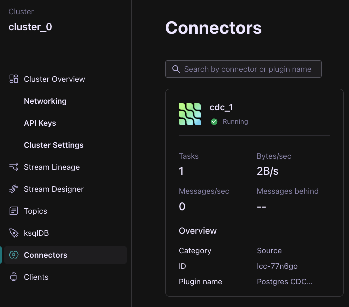

<div align="center" padding=25px>
    
</div>

# <div align="center">Real Time Data Integration and Replication using Confluent Cloud</div>
## <div align="center">Lab Guide</div>
<br>

## **Agenda**

1. [Log in to Confluent Cloud](#step-1)
1. [Create an Environment and Cluster](#step-2)
1. [Create an API Key Pair](#step-3)
1. [Enable Schema Registry](#step-4)
1. [Set up Postgres CDC source connector](#step-5)
1. [Insert Records to the Database](#step-6)
1. [Create Schema for database](#step-7)
1. [Set up Postgres sink connector](#step-8)
1. [Observe Real-time data streaming to destination database](#step-9)
1. [Confluent Resources and Further Testing](#step-10)

***

## **Architecture**

<div align="center">
    
</div>

*** 

## **Prerequisites**
<br>

1. Confluent Cloud Account
    - Sign-up for a Confluent Cloud account [here](https://www.confluent.io/confluent-cloud/tryfree/)
    - Once you have signed up and logged in, click on the menu icon at the upper right hand corner, click on "Billing & payment", then enter payment details under “Payment details & contacts”. A screenshot of the billing UI is included below.

    > **Note:** You will create resources during this workshop that will incur costs. When you sign up for a Confluent Cloud account, you will get free credits to use in Confluent Cloud. This will cover the cost of resources created during the workshop. More details on the specifics can be found [here](https://www.confluent.io/confluent-cloud/tryfree/).

***

## **Objective:**

Welcome to "Seamlessly Connect Sources and Sinks to Confluent Cloud with Kafka Connect"! In this workshop, you will learn how to connect your external systems to Confluent Cloud using Connectors. Confluent offers 180+ pre-built connectors for you to start using today with no coding or developing required. To view the complete list of connectors from Confluent, please see [Confluent Hub](https://www.confluent.io/hub/).

Now, you'll cover what to do when you have other systems you want to pull data from or push data to. This can be anything from a database or data warehouse to object storage or a software application. You can easily connect these systems to Confluent Cloud using one of the pre-built connectors.

During the workshop, you will first set up your Confluent Cloud account, including creating your first cluster and setting up Schema Registry. 

Next, you will set up and deploy 2 connectors: Fully-Managed.

* Fully-Managed Connectors are available as fully-managed and fully hosted in Confluent Cloud. With a simple GUI-based configuration and elastic scaling with no infrastructure to manage, these fully-managed connectors make moving data in and out of Confluent simple. You will be walking through how to launch a fully-managed connector in the UI. Note that it can also be launched using the ccloud CLI. 

You will also learn more about Schema Registry and how you can use it in Confluent Cloud to ensure data compatibility and to manage your schemas. 

By the conclusion of the workshop, you will have learned how to leverage fully-managed connectors to complete your data pipeline!

## <a name="step-1"></a>**Log in to Confluent Cloud**
1. Log in to [Confluent Cloud](https://confluent.cloud) and enter your email and password.

<div align="center" padding=25px>
    
</div>

2. If you are logging in for the first time, you will see a self-guided wizard that walks you through spinning up a cluster. Please minimize this as you will walk through those steps in this workshop. 

*** 

## <a name="step-2"></a>**Create an Environment and Cluster**

An environment contains clusters and its deployed components such as Connectors, ksqlDB, and Schema Registry. You have the ability to create different environments based on your company's requirements. Confluent has seen companies use environments to separate Development/Testing, Pre-Production, and Production clusters.

1. Click **+ Add Environment**. Specify an **Environment Name** and Click **Create**. 

    >**Note:** There is a *default* environment ready in your account upon account creation. You can use this *default* environment for the purpose of this workshop if you do not wish to create an additional environment.

<div align="center" padding=25px>
    
</div>

2. Now that you have an environment, click **Create Cluster**. 

    > **Note:** Confluent Cloud clusters are available in 3 types: Basic, Standard, and Dedicated. Basic is intended for development use cases so you will use that for the workshop. Basic clusters only support single zone availability. Standard and Dedicated clusters are intended for production use and support Multi-zone deployments. If you are interested in learning more about the different types of clusters and their associated features and limits, refer to this [documentation](https://docs.confluent.io/current/cloud/clusters/cluster-types.html).

3. Choose the **Basic** Cluster Type. 

<div align="center" padding=25px>
    
</div>

4. Click **Begin Configuration**.
5. Choose your preferred Cloud Provider (AWS, GCP, or Azure), Region, and Availability Zone.

6. Specify a **Cluster Name** - any name will work here. 

<div align="center" padding=25px>
    
</div>

7. View the associated Configuration & Cost, Usage Limits, and Uptime SLA information before launching.

8. Click **Launch Cluster.**

## <a name="step-3"></a>**Create an API Key Pair**

1. Select **API keys** on the left sidebar menu. 
2. If this is your first API key within your cluster, click **Create key**. If you have set up API keys in your cluster in the past and already have an existing API key, click **+ Add key**.
    <div align="center" padding=25px>
       
    </div>

3. Select **My Account**, then click Next. Give it a description and click **Download and continue**
4. Save your API key and secret - you will need these during the workshop.

## <a name="step-4"></a>**Enable Schema Registry**

A topic contains messages, and each message is a key-value pair. The message key or the message value (or both) can be serialized as JSON, Avro, or Protobuf. A schema defines the structure of the data format. 

Confluent Cloud Schema Registry is used to manage schemas and it defines a scope in which schemas can evolve. It stores a versioned history of all schemas, provides multiple compatibility settings, and allows schemas to evolve according to these compatibility settings. It is also fully-managed.

You will be exploring Confluent Cloud Schema Registry in more detail towards the end of the workshop. First, you will need to enable Schema Registry within your environment.

1. Return to your environment by clicking on the Confluent icon at the top left corner and then clicking your environment tile.
  <div align="center">
      
  </div>

2. Click on **Data Contracts**. Select your cloud provider and region, and then click on **Enable Schema Registry**.

## <a name="step-5"></a>**Set up Postgres CDC source connector**

Let’s say you have a database. How do you connect these data systems to your architecture?

There are 2 options: <br>

1. Develop your own connectors using the Kafka Connect framework (this requires a lot of development time and effort).  
2. You can leverage the 180+ connectors Confluent offers out-of-the-box which allows you to configure your sources and sinks in a few, simple steps. To view the complete list of connectors that Confluent offers, please see [Confluent Hub](https://www.confluent.io/hub/).

With Confluent’s connectors, your data systems can communicate with your services, completing your data pipeline. 

In today's use case, we will be provisioning a Postgres CDC source connector and Postgres sink connector. 

Now that you have completed setting up your Confluent Cloud account, cluster and Schema Registry, this next step will guide you how to configure a postgres connector in Confluent Cloud. 
<br>
1. Click on **Connectors**, then search for **Postgres CDC Source V2 (Debezium)** in the search bar.
   <div align="center">
      
  </div>
  
2. This will redirect you to connector configuration page, select **Use an existing API Key** and provide API key credentials you created earlier.
3. Next, go to the following website - https://real-time-data-integration-6y61.vercel.app/ and click **Create a Database** at the source database and give ```<name>_<random6char>``` Make note of this name.<br>
4. Click on **Refresh Records** button few times to see that there are no records in the new database created.
4. Come back to connectors page and click next. Enter the database details as provided in the workshop.
5. Click continue. This will take a few moments.<br>
6. In the configuration page, modify the following to the values below:<br>
	1. Output record value format: JSON_SR<br>
 	2. Output Kafka record key format: JSON_SR<br>
  	3. Topic prefix: db<br>
   	4. Slot name: <database_name>_debezium<br>
    	5. Publication name: <database_name>_dbz_publication<br>
        6. Click on **Show advances configurations**
   	7. **After-state only: true** and scroll down<br>
	8. Click on **Add SMT**. Configure the following:<br>
 		1. Transform Type: TopicRegexRouter<br>
  		2. Transformation Values:
   		```regex: (.*)\.(.*)\.(.*), replacement: $1_$2_$3``` <br>
   <div align="center">
      
   </div><br>
7. Click Next. Let the connector sizing remain as it is. Click to the next step.<br>
8. Update the connector name to ```<database_name>_cdc```.
10. Click Continue and create the connector.<br>


View the connector, its status, and metrics on the **Connectors** page.

<div align="center">  
	
</div>

## <a name="step-6"></a>**Insert Records to the Database**
Here, we will be inserting new records to the database
1. Go to the website: https://real-time-data-integration-6y61.vercel.app/
2. Click on **Insert Product Records** button.
3. Click on **Submit Records** button to insert these records to the database.
4. Click on **Refresh Records** button to view the new records inserted.
5. Now go back to the Confluent Cloud and click on **Topics** in the left sidebar menu.
6. You can notice on new topic got created: **db_public_products** click on the same and view the messages in the topic.

## <a name="step-7"></a>**Create Schema for database**
Here, we will be creating a database schema to use it in the sink connector we will configure later.
1. Click on the link- https://real-time-data-integration-6y61.vercel.app/
2. Click on Create Schema. Use the database name created earlier as the schema name and click create.
3. Click on *Refresh Records** multiple times to see the data in the target database schema.

## <a name="step-8"></a>**Set up Postgres sink connector**
1. Click on **Connectors**, then **+Add Connector** and search for **Postgres sink** in the search bar.
   <div align="center">
      
  </div>
  
2. This will redirect you to select the topic from which you need data. Select **db_public_products**.
3. Next, select **Use an existing API Key** and you can provide API key credentials you created earlier and click continue.
4. Next, in the database connection details, enter database details as provided in the workshop.
5. Under configuration, set Input Kafka record value format as **JSON_SR** and Insert mode as **UPSERT**.
6. In advanced configuration, modify the following:<br>
	1. Auto create table: true<br>
 	2. Auto add columns: true<br>
  	3. Table name format: <schema_name>.${topic}
   	4. PK mode: record_value
	5. PK Fields: id
7. Scroll down and click on **Add SMT**
 	1. Transform type: TombstoneHandler
	2. behaviour: ignore
8. Click **Continue** and let the connector sizing remain as it is. Click **Continue**.
9. Change the connector name to ```<schema_name>_sink```.
10. Once done, click continue and wait for the sink connector to get provisioned. View the status as running in the connectors page.
   <div align="center">
      
  </div>
   	 
 ## <a name="step-9"></a>**Observe Real-time data streaming to destination database**
  Now that the connectors are configured, 
  1. Go to the site- https://real-time-data-integration-6y61.vercel.app/ and click **Refresh Records**. This will reflect all the previously added records in the source database reflecting on the target database as well.
  2. Click on **Edit** button the source database record and modify any of the values and click on **Save Changes**.
  3. Click on **Refresh Records** to see the change happen in target database as well.

  
    > **Note:** Make sure to delete all the resources created if you no longer wish to use the environment.


## <a name="step-10"></a>**Confluent Resources and Further Testing**

* [Confluent Cloud Documentation](https://docs.confluent.io/cloud/current/overview.html)

* [Confluent Connectors](https://www.confluent.io/hub/) - A recommended next step after the workshop is to deploy a connector of your choice.

* [Confluent Cloud Schema Registry](https://docs.confluent.io/cloud/current/client-apps/schemas-manage.html#)

* [Best Practices for Developing Apache Kafka Applications on Confluent Cloud](https://assets.confluent.io/m/14397e757459a58d/original/20200205-WP-Best_Practices_for_Developing_Apache_Kafka_Applications_on_Confluent_Cloud.pdf) 

* [Confluent Cloud Demos and Examples](https://docs.confluent.io/platform/current/tutorials/examples/ccloud/docs/ccloud-demos-overview.html)

* [Kafka Connect Deep Dive – Error Handling and Dead Letter Queues](https://www.confluent.io/blog/kafka-connect-deep-dive-error-handling-dead-letter-queues/)

