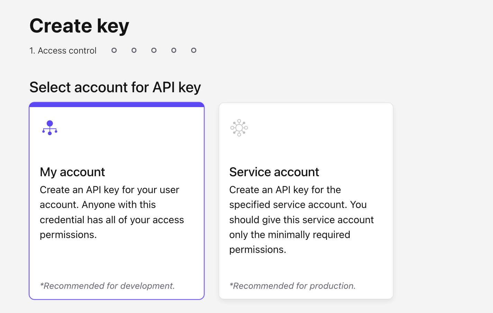
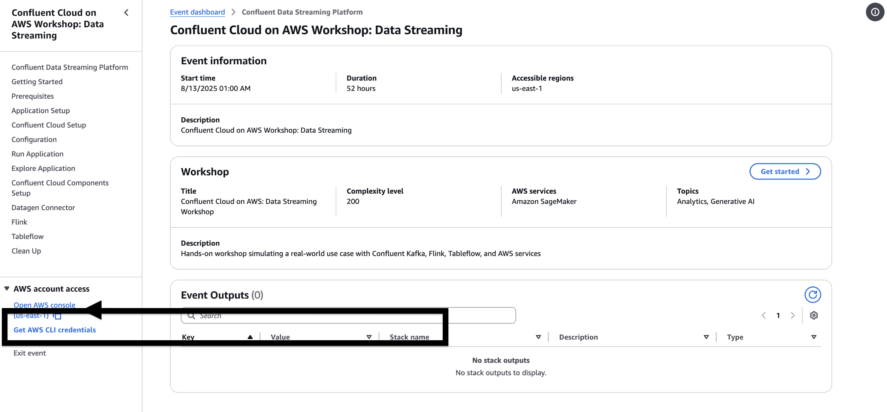
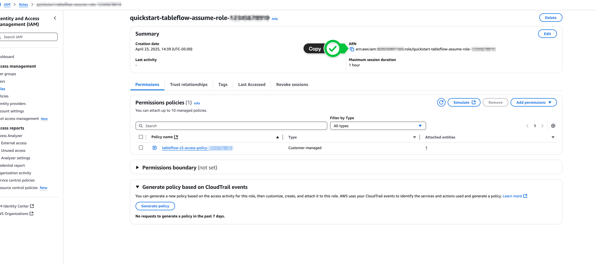
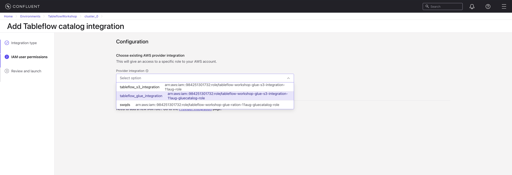

<p align="center">
  
</p>

# Real-Time Data Integration and Analytics using Tableflow & AWS Glue

## Agenda

1. [Clone the Repository and Install Required Packages](#step-1--clone-the-repository-and-install-required-packages)
2. [Set Up Python Environment](#step-2--set-up-python-environment)
3. [Install Required Packages](#step-3--install-required-packages)
4. [Confluent Cloud Setup : Create Environment, Cluster and API Keys](#step-4--confluent-cloud-setup--create-environment-cluster-and-api-keys)
5. [Configuration - Create or Update Properties Files](#step-5--configuration---create-or-update-properties-files)
6. [Create a Topic ecommerce_orders in Confluent Cloud](#step-6--create-a-topic-ecommerce_orders-in-confluent-cloud)
7. [Run the Data Generator](#step-7--run-the-data-generator)
8. [Enable Tableflow Integration](#step-8--enable-tableflow-integration)
9. [Run the Application](#step-9--run-the-application)

## Objective
This workshop demonstrates **Tableflow implementation** to automate streaming of e-commerce data to **AWS S3** in **Iceberg format**, making it immediately available for analytics. The interactive dashboard visualizes real-time sales and product insights, while Tableflow ensures the data pipeline is **reliable, fully managed, and continuously updated**.

<p align="center">
  
</p>

## Architecture
- **Tableflow (Core Highlight):** Streams enriched order and sales data to S3 and syncs metadata with **AWS Glue Catalog**, enabling analytics-ready tables.  
- **AWS Athena:** Queries data stored in S3.  
- **FastAPI + Plotly:** Interactive dashboard for visualizing trends, top products, categories, and customer insights. 

## Key Use Cases Demonstrated
- **Real-time data syncing:** Tableflow continuously moves processed data to S3.  
- **Analytics-ready storage:** Glue Catalog integration makes tables instantly queryable.  
- **Sales and product insights:** Top products, trending items, categories, and locations.  
- **Order monitoring:** Status distribution and weekly/monthly trends.  
- **Custom queries:** Execute Athena queries directly from the dashboard for deeper analysis.  

## How It Works
1. Tableflow streams enriched order data from your source systems into **S3 in Iceberg format**.  
2. Metadata is synced with **AWS Glue Catalog** for instant query capabilities.  
3. The dashboard, built with **FastAPI** and **Plotly**, visualizes the data in charts and tables.  
4. Charts and tables auto-refresh every **20 seconds** to provide near real-time insights.

## Sample Order Data (generated using Python client)

```json
{
  "order_id": "ORD1711",                  // Unique identifier for the order
  "order_date": "2025-08-04T11:36:04.64",   // When the order was placed
  "delivery_date": "2025-08-11T11:36:04.64", // Expected/actual delivery date
  "customer_id": "CUST91",                // Unique customer identifier
  "customer_location": "Mumbai",          // City/region of the customer
  "product_id": "PROD8",                  // Unique identifier for the product
  "product_name": "MacBook Pro",          // Name of the purchased product
  "category": "Electronics",              // Product category
  "quantity": 7,                          // Number of items ordered
  "unit_price": 278.03,                   // Price per unit of the product
  "supplier_id": "SUP15",                 // Unique ID of the supplier
  "supplier_name": "HomeMart",            // Supplier company name
  "warehouse_id": "WH3",                  // Warehouse identifier
  "warehouse_location": "Singapore",      // Location of the warehouse
  "status": "Delivered",                  // Current status of the order
  "return_flag": false,                   // If the order was returned (true/false)
  "return_reason": null,                  // Reason for return (if applicable)
  "logistics_partner": "EcomExpress",     // Courier/logistics company
  "logistics_cost": 50.84,                // Cost incurred for logistics
  "cogs": 145.55,                         // Cost of Goods Sold
  "total_order_value": 917.45,            // Final billed amount
  "profit_margin": 72.64                  // Profit margin earned
}
```

# Prerequisites

Before you begin, make sure the following are set up on your system:

- **Confluent Cloud Account**  
  👉 [Log in / Sign up to Confluent Cloud](https://confluent.cloud)

- **Python 3** (version **3.12 recommended**)  
  👉 [Download Python 3.12 here](https://www.python.org/downloads/release/python-3129/)

- **Two AWS S3 Buckets** (required for this workshop):  
  - One bucket for syncing data to S3 using **Tableflow integration**  
  - One bucket for running **Athena queries**

## Step 1 : Clone the Repository and Install Required Packages

```bash
git clone https://github.com/confluentinc/confluent-workshops.git
cd confluent-workshops/workshop/tableflow-glue-integration-workshop
```

<br>

### Step 2 : Set Up Python Environment

```bash
python3 -m venv venv
```
```bash
source venv/bin/activate
```

<br>

### Step 3 : Install Required Packages

```bash
pip install -r requirements.txt
```

<br>

## Step 4 : Confluent Cloud Setup : Create Environment, Cluster and API Keys

1. Log in to [Confluent Cloud](https://confluent.cloud) and enter your email and password.

2. If this is your first login, you may see a self-guided wizard that helps you create a cluster. Please minimize it, as we’ll go through those steps during the workshop. If not, you can simply skip this and move to the next instruction.

3. Click **Environments** on the left pane of the Web console and click **+ Add cloud environment** button on the right. Specify an **Environment Name** and Click **Create**. 

    > ⚠️ **Note:** An environment contains clusters and its deployed components such as Connectors, ksqlDB, and Schema Registry. You have the ability to create different environments based on your company's requirements. Confluent has seen companies use environments to separate Development/Testing, Pre-Production, and Production clusters.
    
    >There is a *default* environment ready in your account upon account creation. You can use this *default* environment for the purpose of this workshop if you do not wish to create an additional environment.

4. With your environment ready, click Create Cluster. If this option isn’t visible, the Web Console has already redirected you to the cluster creation page. In that case, proceed to the next step.

    > ⚠️ **Note:** Confluent Cloud clusters are available in 5 types: Basic, Standard, Enterprise, Dedicated, and Freight. Basic is intended for development use cases so you will use that for the workshop. Basic clusters only support single zone availability. Standard, Enterprise, Freight, and Dedicated clusters are intended for production use and support Multi-zone deployments. If you are interested in learning more about the different types of clusters and their associated features and limits, refer to this [documentation](https://docs.confluent.io/current/cloud/clusters/cluster-types.html).

5. Create a **Standard or Basic Kafka Cluster** you can choose nearest region to you but please make sure all the AWS resources which you will be using in this workshop should be in same region.


6. Generate and download the **Cluster API Key** and **Schema Registry API Key**
#### Steps to Create Cluster API Key
- Go to the **API Keys** section.
- Select **"My Account"** for generating the API keys.
   
- Download the **API Key** and **Secret**. We will use these values later to update the `client.properties` file during the configuration setup step.
   

#### Steps to Create Schema Registry API Key
- Go to your **Environment** and **Cluster**.
- In the left-hand menu, click **Schema Registry**.

- Click the **API Keys** tab (or **Create API Key** button if none exist).

- Select **Schema Registry** as the resource for the API key.
- Click **Generate** to create a new **API Key** and **Secret**.
- Download or copy the **API Key** and **Secret**.  
   - These will be used in your configuration files (e.g., `client.properties` or your application) to authenticate with Schema Registry.

> ⚠️ **Important:** : **Schema Registry is not available in all regions**, so make sure you are using a region where it exists.

<br>

## Step 5 : Configuration - Create or Update Properties Files

### Create or Update `client.properties` file – Use API Keys and Bootstrap server details created in [Step-4]

> Note: If the `client.properties` file does not exist in the directory, create it and paste the content below. Make sure to update the required values appropriately.

```
# Kafka cluster
bootstrap.servers=<Bootstart Server URL With 9092 Port>
security.protocol=SASL_SSL
sasl.mechanisms=PLAIN
sasl.username=<API Key>
sasl.password=<API Secret>

# Best practice for higher availability in librdkafka clients prior to 1.7
session.timeout.ms=45000

client.id=ccloud-python-client

# Schema Registry
schema.registry.url=<Schema_Registry_URL>
basic.auth.user.info=<Schema Registry API KEY>:<Schema Registry API Secret>
```

### Create or Update the `aws.properties` file with your credentials which would be available in the **outputs** tab of the cloudformation stack in AWS Console. 

Get the AWS Secrets from here


> Note: If the `aws.properties` file does not exist in the directory, create it and paste the content below. Make sure to update the required values appropriately.

```
aws.region=us-east-1
aws.access_key_id=<access_key_id>
aws.secret_access_key=<secret_access_key>
aws.session_token=<Your AWS Session Token>
athena.output_location=s3://<Athena S3 Bucket>/
athena.database=<Confluent Cloud Cluster Id>
athena.table=ecommerce_orders
```
⚠️ [Steps to launch AWS Workspace and Get AWS Creds](https://docs.google.com/document/d/1eD0aB5W6TsAC2J77_KvBNIsTBZ7Ak7ZhOKWb_r2zzBA/edit?tab=t.0)

<br>

## Step 6 : Create a Topic `ecommerce_orders` in Confluent Cloud 

1. Go to your **Environment** and then **Cluster**.
2. In the left-hand menu, click **Topics**.
3. Click the **+ Add Topic** button.
4. Enter a **Topic Name** (Topic name : `ecommerce_orders`).
5. Configure the **Number of Partitions** if needed (default is usually fine for this workshop).
6. Click **Create** to finish.
> ✅ Your topic is now ready to use.

<br>

## Step 7 : Run the Data Generator
1. Open a **terminal** window.
2. Navigate to the workshop directory. (If you’re already in the directory, you can skip this step.)
```bash
cd confluent-workshops/workshop/tableflow-glue-integration-workshop
```
3. Activate the Python virtual environment. (If it’s already activated, you can skip this step.)
```bash
source venv/bin/activate
```
4. Run the data generator script:
```bash
python3 datagen.py
```
- Make sure all configuration/property files are saved.
- Ensure the virtual environment is activated.
✅ This will start generating test data into your Kafka topic.

<br>

## Step 8 : Enable Tableflow Integration

### 👉 Steps to Add Provider Integrations for AWS S3

### 1. Configure Storage Provider Integration (Confluent Cloud)

Now, let's start the process in Confluent Cloud to connect to the S3 bucket.

1.  Navigate back to your **Confluent Cloud** console.
2.  Within your Environment's Cluster, click on **Tableflow** in the left-hand menu.
3.  In the center of the Tableflow page, find the option related to storage connections and click **Go to Provider Integrations**. *(Note: UI text might vary slightly)*.
4.  Click **+ Add Integration**.

 
5.  Choose to **create a new role** when prompted and click **Continue**.

6.  On the "Create Permission Policy in AWS" screen, ensure **Tableflow S3 Bucket** is selected (or similar option representing S3 access).

7.  **IMPORTANT:** Confluent Cloud will display a JSON permissions policy. **Copy this `permissions-policy.json`**. You will need it in the next step to create the IAM policy in AWS. Keep this Confluent Cloud wizard page open.


### 2. Create a New Permissions Policy on AWS

Use the policy JSON copied from Confluent Cloud to create an IAM policy in AWS that grants the necessary S3 permissions.

1.  In a new browser tab or window, go to the **IAM** service in your AWS Management Console.
2.  Click **Policies** in the left navigation pane.
3.  Click **Create Policy**.
4.  Select the **JSON** tab.
5.  Paste the `permissions-policy.json` you copied from the Confluent Cloud wizard into the JSON editor.
6.  **CRITICAL:** Find the `Resource` sections in the JSON policy and replace the placeholder bucket names (e.g., `tableflow-bucket-123456789101` in the document example) with your *actual* S3 bucket name created in Step 1 (e.g., `tableflow-bucket-<<Account-ID>>`). Make sure to update it in both places (e.g., `arn:aws:s3:::your-bucket-name` and `arn:aws:s3:::your-bucket-name/*`).

    ```json
    // Example structure from the document - ensure your bucket name is correct
    {
        "Version": "2012-10-17",
        "Statement": [
            {
                "Effect": "Allow",
                "Action": [
                    "s3:GetBucketLocation",
                    "s3:ListBucketMultipartUploads",
                    "s3:ListBucket"
                ],
                "Resource": [
                    "arn:aws:s3:::<<Your S3 Bucket Name>>" // Replace placeholder
                ]
            },
            {
                "Effect": "Allow",
                "Action": [
                    "s3:PutObject",
                    "s3:PutObjectTagging", // May differ slightly based on wizard version
                    "s3:GetObject",
                    "s3:DeleteObject",
                    "s3:AbortMultipartUpload",
                    "s3:ListMultipartUploadParts"
                ],
                "Resource": [
                    "arn:aws:s3:::<<Your S3 Bucket Name>>/*" // Replace placeholder
                ]
            }
        ]
    }
    ```


7.  Click **Next** (or Next: Tags -> Next: Review).
8.  Give the policy a descriptive **Name**, like `tableflow-s3-access-policy`.
9.  Click **Create Policy**.
10. Return to the **Confluent Cloud** provider integration wizard and click **Continue**.


### 3. Create Role in AWS and Map to Confluent (Initial Steps)

Now, create the IAM role in AWS that Confluent Cloud will assume, using a trust policy provided by Confluent.

1.  The Confluent Cloud wizard should now display a **`trust-policy.json`** on the "Create role in AWS and map to Confluent" page. **Copy this `trust-policy.json`**. Keep the Confluent wizard open.
2.  In AWS, navigate back to the **IAM** service -> **Roles**.
3.  Click **Create role**.
4.  Select **Custom trust policy** as the trusted entity type.
5.  Paste the `trust-policy.json` you copied from Confluent Cloud into the JSON editor.


6.  Click **Next**.
7.  On the **Add permissions** page, search for and select the IAM policy you created in Step 3 (e.g., `tableflow-s3-access-policy`).
8.  Click **Next**.
9.  Enter a **Role name** (e.g., `quickstart-tableflow-assume-role`).
10. Scroll down and click **Create role**.
11. After the role is created, click **View Role** (or find it in the list and click its name).
12. **IMPORTANT:** Find and copy the **ARN** (Amazon Resource Name) of the role you just created. It will look like `arn:aws:iam::<<Your AWS Account ID>>:role/<<Your Role Name>>`.




### 4. Complete Provider Integration (Confluent Cloud & AWS)

Finally, provide the Role ARN to Confluent Cloud and update the role's trust policy in AWS with the External ID from Confluent.

1.  Return to the **Confluent Cloud** Provider Integration wizard page.
2.  Paste the **AWS Role ARN** you just copied into the appropriate field ("AWS ARN " or similar).
3.  Give the Provider Integration a **Name** (e.g., `s3-provider-integration`).
4.  Click **Continue**.
5.  **IMPORTANT:** Confluent Cloud will now display an **updated Trust Policy JSON**, which includes a unique `sts:ExternalId`. **Copy this entire updated `trust-policy.json`**.


6.  Go back to the **AWS IAM Role** you created (e.g., `quickstart-tableflow-assume-role`).
7.  Select the **Trust relationships** tab.
8.  Click **Edit trust policy** (or Edit trust relationship).
9.  **Replace the entire existing JSON** with the updated `trust-policy.json` you copied from Confluent Cloud in the previous step. This adds the necessary External ID condition.
10. Click **Update policy** (or Save changes).
11. Return to the **Confluent Cloud** wizard one last time and click **Continue** (or Finish/Create).

### 👉 Steps to Enable Tableflow on Your Kafka Topic - `ecommerce_orders`

### 5. Enable Tableflow on Your Kafka Topic

With the Provider Integration successfully configured, you can now enable Tableflow for your desired Kafka topics.

1.  **Navigate to Topics:**
    * In your Confluent Cloud console, go to your Environment, then select your Kafka Cluster.
    * In the left-hand navigation menu for your cluster, click on **Topics**. You should see a list of your topics.

2.  **Enable Tableflow for `ecommerce_orders` topic:**
    * Find the specific topic you want to enable Tableflow for in the list.
    * On the right-hand side of the row for that topic, in the "Tableflow" column, click the **Enable Tableflow** button/link.


3.  **Configure Storage:**
    * You will be asked to choose storage. Select **Configure custom storage**.
    
    * In the next menu, choose the **Provider Integration** you just created in Steps 2-5 (e.g., `s3-provider-integration`). You can identify it by the integration name or the IAM Role ARN.
    * Enter your **AWS S3 bucket name** (e.g., `tableflow-bucket-<<account-id>>`) where the Iceberg data should be written.


4.  **Launch Tableflow Sync:**
    * Review the configuration details on the final screen.
    * Click **Launch**.

5.  **Monitor Status:**
    * Back on the Topics page, you will see the status for that topic change under the Tableflow column, first to `Tableflow sync pending` and then shortly after to `Syncing`.


### 👉 Steps to Enable Glue Integration

### 6. Enable Glue Integration - Navigate to Provider Integrations

1.  In your **Confluent Cloud** console, navigate to your Cluster: Environment > Your Environment > Your Cluster
2.  Click on **Tableflow** in the left-hand menu.
3.  Click on ** View provider Integrations**.

    


### 7. Start Creating the *New* Provider Integration for Glue

**Important:** This creates a *separate* IAM Role and Provider Integration specifically for allowing Confluent Cloud to interact with your AWS Glue Data Catalog. It is *different* from the `s3-provider-integration` role used for writing data to S3.

1.  In the Provider Integrations section, click **+ Add Integration**.
2.  Choose to **create a new role** when prompted and click **Continue**.
3.  On the "Create Permission Policy in AWS" screen, ensure the Confluent Resource selected is **Tableflow Glue Catalog sync** (or similar wording indicating Glue access, *not* S3 access).
4.  **IMPORTANT:** Confluent Cloud will display a JSON permissions policy specifically for Glue access. **Copy this `permissions-policy.json`**. You will need it in the next step. Keep this Confluent Cloud wizard page open.


### 8. Create AWS IAM Policy for Glue Access

Use the policy JSON copied from the *Glue* wizard step to create an IAM policy in AWS.

1.  In your **AWS Management Console**, navigate to the **IAM** service.
2.  Click **Policies** -> **Create Policy**.
3.  Select the **JSON** tab.
4.  Paste the `permissions-policy.json` you copied in the previous step (specific to Glue access). *This policy grants permissions like `glue:GetDatabase`, `glue:CreateTable`, `glue:UpdateTable`, etc.*
5. Ensure you modify the Resource block to input your region (e.g. `us-east-2`) and account number.


6.  Click **Next** (or Next: Tags -> Next: Review).
7.  Give the policy a descriptive **Name**, like `tableflow-glue-access-policy`.
8.  Click **Create Policy**.
9.  Return to the **Confluent Cloud** provider integration wizard and click **Continue**.


### 9. Create AWS IAM Role for Glue Access (Initial)

Create a new IAM role in AWS that Confluent Cloud will assume *specifically for Glue access*.

1.  The Confluent Cloud wizard (for the Glue Provider Integration) should now display a **`trust-policy.json`** on the "Create role in AWS and map to Confluent" page. **Copy this `trust-policy.json`**. Keep the wizard open.
2.  In **AWS IAM**, navigate to **Roles** -> **Create role**.
3.  Select **Custom trust policy**.
4.  Paste the `trust-policy.json` you copied from the *Glue* Provider Integration wizard into the JSON editor.
5.  Click **Next**.
6.  On the **Add permissions** page, search for and select the IAM policy you created specifically for Glue access in Step 3 (e.g., `tableflow-glue-access-policy`).
7.  Click **Next**.
8.  Enter a **Role name** (distinct from your S3 role), e.g., `quickstart-tableflow-glue-assume-role`.
9.  Scroll down and click **Create role**.
10. After the role is created, view the role details and **copy its ARN**.


### 10. Complete Glue Provider Integration (Confluent & AWS)

Link the new Glue IAM role back to Confluent Cloud within the Provider Integration wizard.

1.  Return to the **Confluent Cloud** wizard for the Glue Provider Integration.
2.  Paste the **AWS Role ARN** for the *Glue access role* (copied in the previous step) into the appropriate field.
3.  Give this Glue-specific **Provider Integration** a **Name** (e.g., `glue-provider-integration`). Make a note of this name.
4.  Click **Continue**.
5.  **IMPORTANT:** Confluent Cloud will display an **updated Trust Policy JSON** (with the External ID) for the *Glue access role*. **Copy this entire updated `trust-policy.json`**.
6.  Go back to the **AWS IAM Role** you created specifically for Glue access (e.g., `quickstart-tableflow-glue-assume-role`).
7.  Select the **Trust relationships** tab and click **Edit trust policy**.
8.  **Replace the entire existing JSON** with the updated `trust-policy.json` (containing the External ID) you copied from Confluent Cloud.
9.  Click **Update policy**.
10. Return to the **Confluent Cloud** wizard and click **Continue** (or Finish/Create) to complete the Glue Provider Integration setup. You should now see `glue-provider-integration` listed in your Provider Integrations.

### 11. Create Catalog Integration

Now, create the Catalog Integration and link it to the Glue Provider Integration you just finished setting up.

1.  In your **Confluent Cloud** console, navigate to your Environment -> **Tableflow**.
2.  Scroll down to the **External Catalog Integration** section.

3.  Click **+ Add Integration**.
4.  For the integration type, select **AWS Glue** as the catalog.
5.  Provide a **Name** for this catalog integration instance, for example, `my-glue-catalog-integration`.
6.  In the section asking for the provider integration, **select the existing Glue Provider Integration** you created in the previous steps (e.g., `glue-provider-integration`) from the dropdown or list.

7.  Review the overall configuration for the AWS Glue Catalog Integration.
8.  Click **Launch** (or Continue/Create).


### 12. Verification (Glue Catalog)

1.  Monitor the status of the **Catalog Integration** (`my-glue-catalog-integration`) in the Confluent Cloud Tableflow UI. It should transition to **Connected** or **Running**.
2.  Navigate to the **AWS Glue Data Catalog** service in your AWS Console.
3.  Look for a new **Database** named after your Confluent Cloud Kafka Cluster ID (e.g., `lkc-xxxxxx`).
4.  Inside that database, you should start seeing **Tables** appearing with names corresponding to the Kafka topics.
5.  It might take a few minutes for the initial sync and table creation to occur.


<br>

## Step 9 : Run the Application

### Start FastAPI Server
Before running the server:
1. Open a **new terminal** window.
2. Navigate to the workshop directory:
```bash
cd confluent-workshops/workshop/tableflow-glue-integration-workshop
```
3. Activate the Python virtual environment:
```bash
source venv/bin/activate
```
- Make sure all configuration/property files are saved.
- Ensure the virtual environment is activated.
4. Run the FastAPI server:

```bash
uvicorn app.main:app --reload
```

The server will start on http://127.0.0.1:8000 by default.

The application displays 6 interactive charts — Top Customer Locations, Top Product Categories by Profit, Weekly Total Sales, Top Products by Quantity Sold, Trending Top 5 Products This Week, Weekly Order Status Trend — along with a Query Editor for executing custom Athena SQL queries.

## Your application will look like this


## Sample Queries to Run in Query Editor

Here are a few example SQL queries you can run against the `ecommerce_orders` table in the Query Editor:
```sql
SELECT 
    product_name,
    SUM(quantity) AS total_quantity,
    DATE_PARSE(order_date, '%Y-%m-%dT%H:%i:%s.%f') AS order_day
FROM ecommerce_orders
WHERE order_date >= date_format(current_date - interval '7' day, '%Y-%m-%d')
GROUP BY product_name, DATE_PARSE(order_date, '%Y-%m-%dT%H:%i:%s.%f');
```

> This query shows the total quantity of each product ordered per day for the last 7 days. It helps identify which products are trending on a daily basis.

```sql
SELECT 
    date_trunc('week', DATE_PARSE(order_date, '%Y-%m-%dT%H:%i:%s.%f')) AS week,
    status,
    COUNT(*) AS order_count
FROM ecommerce_orders
GROUP BY 1, 2
ORDER BY week;
```

> This query tracks the number of orders by status (Delivered, Pending, Cancelled, etc.) each week, giving insight into operational performance.

```sql
SELECT 
    date_trunc('week', DATE_PARSE(order_date, '%Y-%m-%dT%H:%i:%s.%f')) AS week_start,
    SUM(total_order_value) AS weekly_sales
FROM ecommerce_orders
WHERE DATE_PARSE(order_date, '%Y-%m-%dT%H:%i:%s.%f') >= date_add('week', -7, current_date)
GROUP BY date_trunc('week', DATE_PARSE(order_date, '%Y-%m-%dT%H:%i:%s.%f'))
ORDER BY week_start ASC;
```

> This query calculates the total sales value per week over the last 7 weeks. It helps track revenue growth and seasonal patterns.
