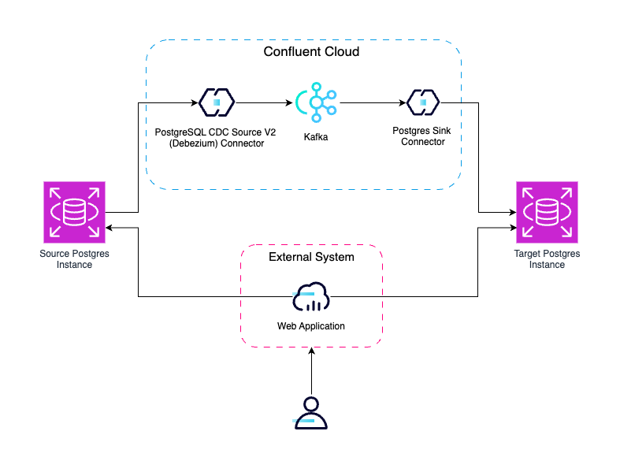
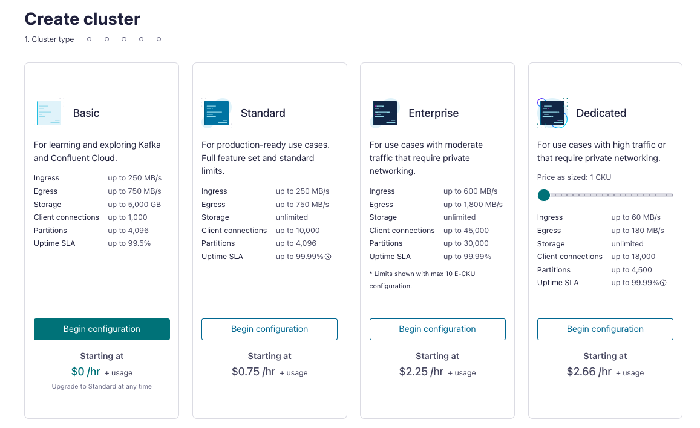

<div align="center" padding=25px>
    
</div>

# <div align="center">Real Time Data Integration and Replication using Confluent Cloud</div>
## <div align="center">Lab Guide</div>
<br>

## **Agenda**

1. [Log in to Confluent Cloud](#step-1)
1. [Create an Environment and Cluster](#step-2)
1. [Create an API Key Pair](#step-3)
1. [Set up Postgres CDC source connector](#step-4)
1. [Insert Records to the Database](#step-5)
1. [Create Schema for database](#step-6)
1. [Set up Postgres sink connector](#step-7)
1. [Observe Real-time data streaming to destination database](#step-8)
1. [Confluent Resources and Further Testing](#step-9)

***

## **Architecture**

<div align="center">
    
</div>

*** 

## **Prerequisites**
<br>

1. Confluent Cloud Account
    - Sign-up for a Confluent Cloud account [here](https://www.confluent.io/confluent-cloud/tryfree/)
    - Once you have signed up and logged in, click on the menu icon at the upper right hand corner, click on "Billing & payment", then enter payment details under “Payment details & contacts”. A screenshot of the billing UI is included below.

    > **Note:** You will create resources during this workshop that will incur costs. When you sign up for a Confluent Cloud account, you will get free credits to use in Confluent Cloud. This will cover the cost of resources created during the workshop. More details on the specifics can be found [here](https://www.confluent.io/confluent-cloud/tryfree/).

***

## **Objective:**

Welcome to “Seamlessly Connect Sources and Sinks to Confluent Cloud with Kafka Connect.”
In this workshop, you’ll learn how to integrate external systems with Confluent Cloud using Connectors. Confluent provides 180+ pre-built, no-code connectors, all available on [Confluent Hub](https://www.confluent.io/hub/).

You’ll explore how to connect data from various systems—whether it’s databases, data warehouses, object storage, or applications—directly to Confluent Cloud using these ready-to-use connectors.

You’ll begin by setting up your Confluent Cloud account, creating your first Kafka cluster, and configuring Schema Registry.

Next, you’ll deploy two Fully-Managed Connectors. These connectors run entirely in Confluent Cloud, require no infrastructure management, and offer an easy GUI-based setup with elastic scaling. We’ll walk through launching a fully-managed connector in the UI, with a note that the same can be done using the ```confluent``` CLI.

You will also gain a deeper understanding of Schema Registry—how it works, its role in ensuring data compatibility, and how to manage schemas within Confluent Cloud.

By the end of the workshop, you’ll know how to use fully-managed connectors to build and complete your data pipelines with ease.


## <a name="step-1"></a>**Log in to Confluent Cloud**
1. Log in to [Confluent Cloud](https://confluent.cloud) and enter your email and password.

<div align="center" padding=25px>
    
</div>

2. If you are logging in for the first time, you will see a self-guided wizard that walks you through spinning up a cluster. Please minimize this as you will walk through those steps in this workshop. 

*** 

## <a name="step-2"></a>**Create an Environment and Cluster**

An environment groups together your clusters and all associated components—such as Flink and Schema Registry. You can create multiple environments to align with your organization’s needs. Many companies use environments to clearly separate Development/Testing, Pre-Production, and Production clusters.

1. Click **+ Add Environment**. Specify an **Environment Name** and Click **Create**. 

    >**Note:** There is a *default* environment ready in your account upon account creation. You can use this *default* environment for the purpose of this workshop if you do not wish to create an additional environment.

<div align="center" padding=25px>
    
</div>

2. Now that you have an environment, click **Create Cluster**. 

    > **Note:** Confluent Cloud clusters are available in 5 types: Basic, Standard, Enterprise, Freight, and Dedicated. Basic is intended for development use cases so you will use that for the workshop. Basic clusters only support single zone availability. Standard, Enterprise, Freight, and Dedicated clusters are intended for production use and support Multi-zone deployments. If you are interested in learning more about the different types of clusters and their associated features and limits, refer to this [documentation](https://docs.confluent.io/current/cloud/clusters/cluster-types.html).

3. Choose the **Basic** Cluster Type. 

<div align="center" padding=25px>
    
</div>

4. Click **Begin Configuration**.
5. Choose your preferred Cloud Provider (AWS, GCP, or Azure), Region, and Availability Zone.

6. Specify a **Cluster Name** - any name will work here. 

<div align="center" padding=25px>
    
</div>

7. View the associated Configuration & Cost, Usage Limits, and Uptime SLA information before launching.

8. Click **Launch Cluster.**

## <a name="step-3"></a>**Create an API Key Pair**

1. Select **API keys** on the left sidebar menu. 
2. If this is your first API key within your cluster, click **Create key**. If you have set up API keys in your cluster in the past and already have an existing API key, click **+ Add key**.
    <div align="center" padding=25px>
       
    </div>

3. Select **My Account**, then click Next. Give it a description and click **Download and continue**
4. Save your API key and secret - you will need these during the workshop.

## <a name="step-4"></a>**Set up Postgres CDC source connector**

Let’s say you have a database. How do you connect these data systems to your architecture?

There are 2 options: <br>

1. Develop your own connectors using the Kafka Connect framework (this requires a lot of development time and effort).  
2. You can leverage the 180+ connectors Confluent offers out-of-the-box which allows you to configure your sources and sinks in a few, simple steps. To view the complete list of connectors that Confluent offers, please see [Confluent Hub](https://www.confluent.io/hub/).

Confluent connectors unify your services and data systems into a single, cohesive pipeline. 

Today, we are focusing on a Postgres CDC source-to-sink use case. 

Since your cluster and Schema Registry are already set up, let’s move directly into configuring your Postgres connectors in the Confluent Cloud console.
 
<br>
1. Click on **Connectors**, then search for **Postgres CDC Source V2 (Debezium)** in the search bar.
   <div align="center">
      
  </div>
  
2. This will redirect you to connector configuration page, select **Use an existing API Key** and provide API key credentials you created earlier.
3. Next, open the web application URL (as shared by the instructor) and click **Create a Database** at the source database and give ```<name>_<random6char>``` Make note of this name.<br>
4. Click the **Refresh Records** button in the web application a few times to confirm that your newly created database is currently empty.
5. Come back to Confluent Cloud's Connectors page and click **Next**. Enter the database details as provided in the workshop.
6. Click **continue**. This will take a few moments.
7. In the configuration page, modify the following to the values below:<br>
	a. Output record value format: **JSON_SR**<br>
 	b. Output Kafka record key format: **JSON_SR**<br>
  	c. Topic prefix: **db**<br>
   	d. Slot name: **<database_name>_debezium**<br>
    e. Publication name: **<database_name>_dbz_publication**<br>
    f. Click on **Show advances configurations** <br>
   	g. After-state only: **true** <br>
    h. Decimal Handling mode: **double** and scroll down<br>
	i. Click on **Add SMT**. Configure the following:<br>
 		-- Transform Type: **TopicRegexRouter**<br>
  		-- Transformation Values:
   		```regex: (.*)\.(.*)\.(.*), replacement: $1_$2_$3``` <br>
   <div align="center">
      
   </div><br>
8. Click **Next**. Let the connector sizing remain as it is. Click to the next step.<br>
9. Update the connector name to ```<database_name>_cdc```.
10. Click **Continue** and create the connector.<br>


View the connector, its status, and metrics on the **Connectors** page.

<div align="center">  
	
</div>

## <a name="step-5"></a>**Insert Records to the Database**
Here, you will be inserting new records to the database<br>
1. Go to the web application URL and click the **Insert Product Records** button.
2. Click on **Submit Records** button to insert new records in the database.
3. Click on **Refresh Records** button to view the new records.
4. Now go back to the Confluent Cloud and click on **Topics** option in the left sidebar menu.
5. You can notice on new topic got created: **db_public_products** click on the same and view the messages in the topic.

## <a name="step-6"></a>**Create Schema for database**
Here, you will create a database schema to use it in the sink connector that you will configure later.
1. Go to the web application URL and click **Create Schema**. Use the database name created earlier as the schema name and click **Create**.
3. Click on *Refresh Records** multiple times to see the data in the target database schema.

## <a name="step-7"></a>**Set up Postgres sink connector**
1. Click on **Connectors**, then **+Add Connector** and search for **Postgres sink** in the search bar.
   <div align="center">
      
  </div>
  
2. This will redirect you to select the topic from which you need data. Select **db_public_products**.
3. Next, select **Use an existing API Key** and you can provide API key credentials you created earlier and click continue.
4. Next, in the database connection details, enter database details as provided in the workshop.
5. Under configuration, set Input Kafka record value format as **JSON_SR** and Insert mode as **UPSERT**.
6. In advanced configuration, modify the following:<br>
	-- Auto create table: **true**<br>
 	-- Auto add columns: **true**<br>
  	-- Table name format: **<schema_name>.${topic}**<br> 
   	-- PK mode: **record_value**<br>
	-- PK Fields: **id**<br>
7. Scroll down and click on **Add SMT** <br>
 	-- Transform type: **TombstoneHandler**<br>
	-- behaviour: **ignore**<br>
8. Click **Continue** and let the connector sizing remain as it is. Click **Continue**.
9. Change the connector name to ```<schema_name>_sink```.
10. Once done, click continue and wait for the sink connector to get provisioned. View the status as running in the connectors page.
   <div align="center">
      
  </div>
   	 
 ## <a name="step-8"></a>**Observe Real-time data streaming to destination database**
  Now that the connectors are configured, 
  1. Go to the site provided and click **Refresh Records**. This will reflect all the previously added records in the source database reflecting on the target database as well.
  2. Click on **Edit** button the source database record and modify any of the values and click on **Save Changes**.
  3. Click on **Refresh Records** to see the change happen in target database as well.

  
  This is the end of Lab1, please continue with **[Lab 2](Lab-2.md)**

