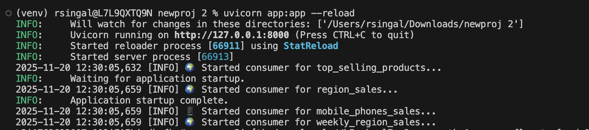
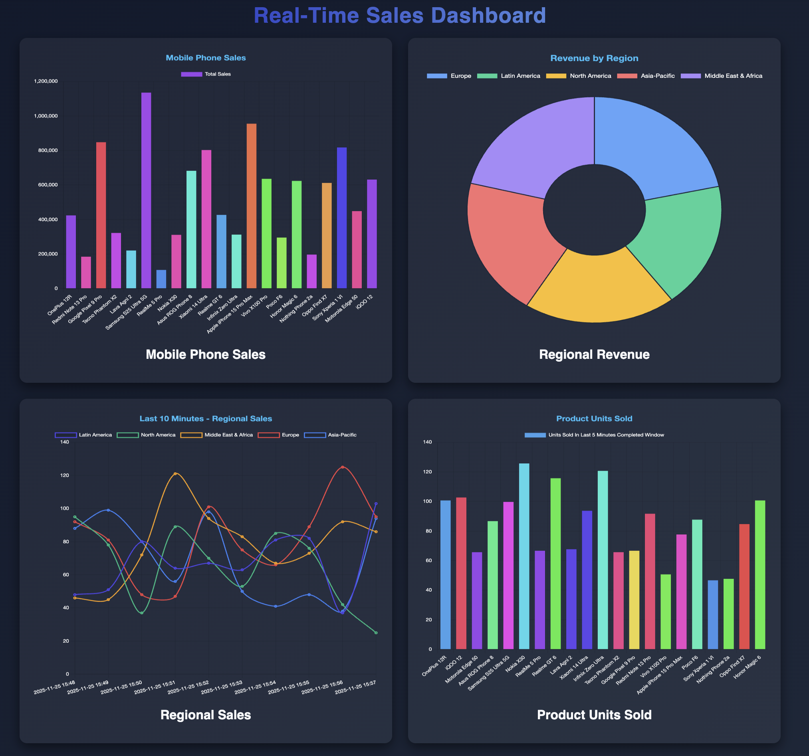

# 🚀 Lab 2: Real-time Stream Processing Using Flink

In this Lab, we will also explore **real-time stream processing** using Flink on Confluent Cloud. You will interact with various data sources and learn how to process them in real time.

-----

## 💻 Prerequisites

Before starting, ensure you have the following installed:

  * **Python 3.x**
  * **Git**
  * **Confluent Cloud Account**

> **Note:** Completing **Lab 1** is required before starting **Lab 2**.

-----

## **Objective**

In this lab, you will dive deeper into Flink features by learning how different Flink SQL statements and functions work in real-time stream processing. You will explore concepts such as tumble windowing, event-time operations, and stateful computations. Additionally, you will understand how Flink performs aggregations and how various types of joins can be applied to combine and enrich streaming data efficiently.

-----

## 🔧 Setup

### 1\. Clone the Repository

Open your terminal and clone the project repository:

```bash
git clone https://github.com/confluentinc/confluent-workshops.git
cd confluent-workshops/workshop/waw-flink
```

### 2\. Activate Python Virtual Environment

It's highly recommended to use a virtual environment to manage dependencies.

```bash
# Create a virtual environment
python3 -m venv venv

# Activate the virtual environment
source venv/bin/activate
# On Windows, use: venv\Scripts\activate
```

### 3\. Install Dependencies

Install all necessary Python packages using `pip`:

```bash
pip3 install -r requirements.txt
```

-----

## 🔑 Confluent Cloud Configuration

You need to generate two separate sets of API keys: one for connecting to the **Kafka Cluster** and another for the **Schema Registry**.

### 4\. Generate Cluster API Keys
> **Note:** You can also reuse the same Cluster API key that you created in Lab-1, instead of creating a new one.

This key pair provides the necessary credentials for the application (producers and consumers) to connect to your Kafka cluster via **SASL/PLAIN** authentication.

1.  **Access the Confluent Cloud Console:**

      * Log in to your Confluent Cloud account.
      * Select the **Environment** and the **Kafka Cluster** you are working with.

2.  **Navigate to API Keys:**

      * In the cluster's left-hand navigation menu, Click on **API Keys** .

3.  **Start Key Creation:** 

      * On the API Keys page, click the **+ Add key** or **Create key** button.
      <div align="center">
          
      </div>
      
4.  **Configure and Download:**

      * Give the key a meaningful **Description** (e.g., `Retail-App-Cluster-Key`).
      * Click **Download and continue**.

-----

### 5\. Generate Schema Registry API Keys

This separate key pair provides credentials specifically for communicating with the Schema Registry service to manage Avro schemas. --> why only Avro

1.  **Navigate to Schema Registry:**

      * In the Confluent Cloud Console, select the **Environment** you are working with.
      * Click the Schema Registry icon on the left sidebar.

      <div align="center">
          
      </div>

2.  **Access API Keys:**

      * In the Schema Registry navigation menu, click on **API keys**.

      <div align="center">
          
      </div>

3.  **Start Key Creation:**

      * Click the **+ Add key** or **Create key** button.
      * Select **My Account**.

4.  **Configure and Download:**

      * Select **Schema Regsitry** resource scope for API key.
      * Select **your environment** and click **Next**.
      
      <div align="center">
          
      </div>

      * Provide a relevant **Name** and **Description** (e.g., `Retail-App-SR-Key`).
      * Click **Create API Key**.


5.  **Securely Save Keys:**

      * The generated **API Key** and **API Secret** for the Schema Registry will be displayed.
      * Click **Download and continue**.

    > **Note:** These key and secret are your **Schema Registry API Key** and **Schema Registry API Secret** for configuring `client.properties`.

-----

## ⚙️ Configuration File Updates

This section details how to configure your application to connect to both **Confluent Cloud** (Kafka and Schema Registry) and your **PostgreSQL database**.

### 6\. Update `client.properties` (Confluent Cloud Details)

This file stores the authentication and connection information for your Confluent Cloud services.

1.  **Locate or Create the File:**

      * Check your project directory for a file named `client.properties`.

    > **Note:** If the file does not exist, **create it** in the project root directory.

2.  **Paste Content:**

      *  Open the file and review the following structure, which you will update with details:

    <!-- end list -->

    ```properties
    # Kafka cluster
    bootstrap.servers=<Your Cluster Bootstrap Server URL:9092>  # Example: pkc-l7pr2.us-west-2.aws.confluent.cloud:9092
    security.protocol=SASL_SSL
    sasl.mechanisms=PLAIN
    sasl.username=<Your Cluster API Key>
    sasl.password=<Your Cluster API Secret>

    # Best practice for higher availability in librdkafka clients prior to 1.7
    session.timeout.ms=45000

    client.id=ccloud-python-client

    # Schema Registry
    schema.registry.url=<Your Schema Registry URL> # Example: https://psrc-xxxx.us-west-2.confluent.cloud
    basic.auth.user.info=<Schema Registry API KEY>:<Schema Registry API Secret>
    ```

3.  **Update Kafka Cluster Details:**

      * Replace `<Your Cluster Bootstrap Server URL:9092>` with the endpoint of your Kafka cluster.
      * Replace `<Your Cluster API Key>` with the **API Key** generated in Step 4.
      * Replace `<Your Cluster API Secret>` with the **API Secret** generated in Step 4.

4.  **Update Schema Registry Details:**

      * Replace `<Your Schema Registry URL>` with the endpoint of your Schema Registry.
      * Replace the entire string `<Schema Registry API KEY>:<Schema Registry API Secret>` with the Schema Registry API Key and Secret generated in Step 5, ensuring they are separated by a colon (`:`).

5.  **Save** the `client.properties` file.

-----

### 7\. Update PostgreSQL Configuration File

This file stores the necessary credentials to connect your Python application scripts to the PostgreSQL database.

1.  **Locate the File:**

      * Locate the database configuration file, typically named `psql_client.properties`, in your project directory.

    > **Note:** If the file does not exist, **create it** in the project root directory.

2.  **Open and Review Content:**

      * Open the file and review the following structure, which you will update with details from the shared spreadsheet:

    <!-- end list -->

    ```properties
    # PostgreSQL
    host=<Your RDS Database Hostname>
    database=<Your RDS DB>
    user=<Your RDS User>
    password=<Your RDS Password>
    port=5432
    ```

3.  **Update PostgreSQL Details:**

      * **`password`**: Replace `<RDS Password>` with the password for the source database user shared in the spreadsheet.
      * **`host`**: Replace `<RDS Database Hostname>` with the full hostname of the source PostgreSQL instance provided in the spreadsheet.
      * **Verify** that the values for `postgres.user`, `postgres.port`, and `postgres.db` match the settings provided in the shared spreadsheet.

4.  **Save** the `psql_client.properties` file.

-----

## 🛠️ Application Execution

### 8\. Populate PostgreSQL Database (Initial Data)

Run the dedicated Python script to add initial **product data** into your PostgreSQL database.

```bash
python3 insert_records.py
```
Please wait until you see the message: ✅ Inserted all unique products
      <div align="center">
          
      </div>

### 9\. Generate Sales Events (Kafka Producer)

Run the dedicated Python script to start producing simulated **sales events** to your configured Kafka topic. **Keep this process running** as it simulates a continuous stream of data.

```bash
python3 generate_sales_event.py
```


-----

Here are the detailed steps for setting up and running your real-time data processing using **Apache Flink** in Confluent Cloud.

-----

## 📊 Real-Time Data Processing

This section details how to provision the Flink environment and execute the SQL queries that process the Kafka data stream.

### 10\. Create Flink Compute Pool

A **Compute Pool** provides the necessary processing resources for running Flink SQL jobs.

1.  **Access Flink Service:**

      * In the left-hand navigation pane inside your environment navigate to the **Flink**

      <div align="center">
          
      </div>

2.  **Start Pool Creation:**

      * On the Flink overview page, click **Create compute pool**.

      <div align="center">
          
      </div>

3.  **Configure Compute Pool:**

      * **Cloud Provider & Region:**
          * **Crucial Step:** Select the **SAME Cloud Provider and Region** as your Kafka Cluster. 
          * **Name/Description:** Give your Compute Pool a clear name or leave it as default name (e.g., `Sales-Analytics-Pool`).
      * **Compute Resources:** Let the connector sizing remain as it is.

4.  **Confirm Creation:**

      * Review the configuration and click **Create**.

### 11\. Open Flink SQL Workspace

The Flink SQL Workspace is where you will define and execute your stream processing jobs.

1.  **Navigate to SQL Workspace:**

      * Once the Compute Pool is **Running**, you can navigate to the SQL Workspace.
      * On the main Flink page, locate your new Compute Pool.
      * Click on **Open SQL workspace** associated with your active Compute Pool.

      <div align="center">
          
      </div>

2.  **Environment Check:**

      * The SQL Workspace environment will open, ready for you to input SQL queries.
      * Make sure you set with the right catalog (=Your Environment Name) and database (=Your Cluster Name).

      <div align="center">
          
      </div>

### 12\. Run Flink Queries


### 1\. Defining the Enriched Sales Events Topic

```sql
CREATE TABLE aggregated_sales_events (
  event_id STRING,
  event_timestamp_str STRING,
  product_name STRING,
  units_sold BIGINT,
  region STRING,
  product_id INT,
  cost_price DOUBLE,
  inventory_on_hand INT,
  product_created_at STRING,
  event_timestamp AS TO_TIMESTAMP(event_timestamp_str, 'yyyy-MM-dd''T''HH:mm:ss.SSSSSSXXX'),
  WATERMARK FOR event_timestamp AS event_timestamp - INTERVAL '1' MINUTE
) WITH (
  'scan.bounded.mode' = 'unbounded',
  'value.format' = 'json-registry'
);
```

This statement creates a streaming table `aggregated_sales_events` that merges sales events with product attributes, parses the raw `event_timestamp_str` into a proper event_timestamp for accurate event-time processing, and applies a 1‑minute Watermark so slightly late or out‑of‑order events still land in the correct time windows. It runs as an unbounded stream (continuous ingestion) and expects data in json-registry format (JSON with a schema registry), ensuring consistent parsing and reliable time‑windowed aggregations for downstream analytics.

-----

### 2\. Data Enrichment and Filtering Job

```sql
INSERT INTO aggregated_sales_events
SELECT
    s.event_id,
    s.event_timestamp,
    s.product_name,
    s.units_sold,
    s.region,
    p.id AS product_id,
    p.price AS cost_price,
    p.quantity AS inventory_on_hand,
    p.created_at AS product_created_at
FROM
    sales_event AS s
LEFT JOIN
    db_public_products AS p
ON
    s.product_name = p.name
WHERE
    p.name IS NOT NULL AND p.`__deleted` = 'false';
```

This job enriches the real-time sales stream by joining `sales_event` with product metadata from the PostgreSQL CDC table db_public_products, selecting fields like `product ID`, `cost price`, `inventory`, and `product creation time`. It filters to only valid, active products using `p.name IS NOT NULL` and `p.__deleted = 'false'`, ensuring orphaned or deleted products don’t flow downstream. The enriched records are inserted into `aggregated_sales_events`, providing a comprehensive, analysis-ready stream that combines sales facts with up-to-date product attributes.

-----

### 3\. Units sold in 5 minutes window (Hopping Window)

```sql
CREATE TABLE `units_sold_last_5m_window` (
product_name STRING,
window_start TIMESTAMP(3),
window_end TIMESTAMP(3),
total_units BIGINT,
PRIMARY KEY (product_name) NOT ENFORCED
) WITH (
'key.format' = 'json-registry',
'value.format' = 'json-registry' );
```

```sql
INSERT INTO `units_sold_last_5m_window`
SELECT
  product_name,
  window_start,
  window_end,
  SUM(units_sold) AS total_units
FROM TABLE(
  HOP(
    DATA => TABLE aggregated_sales_events,
    TIMECOL => DESCRIPTOR(event_timestamp),
    SLIDE => INTERVAL '5' MINUTE,     
    SIZE  => INTERVAL '5' MINUTE   
  )
)
GROUP BY product_name, window_start, window_end;
```

This job computes top-selling products over rolling five-minute windows by writing windowed aggregates into the sink table `units_sold_last_5m_window`. It uses a hopping window with both SIZE and SLIDE set to 5 minutes (effectively 5‑minute windows), grouping by product name and the window boundaries and calculating SUM(units_sold) as `total_units`. The windowing is driven by the `event_timestamp` from `aggregated_sales_events`, so late or out‑of‑order events are handled according to that table’s 1‑minute Watermark, ensuring accurate counts per window. The sink schema stores `product_name`, `window_start`, `window_end`, and `total_units`, declares a non‑enforced primary key on `product_name`, and uses json-registry for both key and value to ensure consistent serialization for downstream consumers.

-----

### 4\. Real-Time Product Revenue Calculation

```sql
CREATE TABLE mobile_phones_sales (
    product_name STRING,
    total_sales DOUBLE,
    PRIMARY KEY (product_name) NOT ENFORCED
) WITH (
  'key.format' = 'json-registry',
  'value.format' = 'json-registry'
);
```

```sql
INSERT INTO mobile_phones_sales
SELECT
    product_name,
    SUM(cost_price * units_sold) AS total_sales
FROM
    aggregated_sales_events
GROUP BY
    product_name;
```

This job aggregates total sales value per product by multiplying each event’s `cost_price` with `units_sold` and summing the result across all events, then writes the per-product totals into the sink table `mobile_phones_sales`. The sink schema stores `product_name` as the (non-enforced) primary key and `total_sales` as the aggregate metric, with both key and value serialized using json-registry for consistent downstream consumption. The source is the enriched, event-time–aware `aggregated_sales_events` stream, ensuring the calculation reflects up-to-date sales activity combined with product attributes.

-----

### 5\. Sales Metrics by Region

```sql
CREATE TABLE region_sales (
    region STRING,
    total_units BIGINT,
    total_revenue DOUBLE,
    PRIMARY KEY (region) NOT ENFORCED
) WITH (
  'key.format' = 'json-registry',
  'value.format' = 'json-registry'
);
```

```sql
INSERT INTO region_sales
SELECT
  region,
  SUM(units_sold) AS total_units,
  SUM(units_sold * cost_price) AS total_revenue
FROM aggregated_sales_events
GROUP BY region;
```

This job aggregates sales by region and writes the results to the sink table `region_sales`. It reads from the enriched stream `aggregated_sales_events` and computes per-region totals using `SUM(units_sold)` as `total_units` and `SUM(units_sold * cost_price)` as `total_revenue`, ensuring both volume and revenue are captured for each region. The sink schema declares a non-enforced primary key on `region` and uses json-registry for both key and value serialization, making the output consistent and easy for downstream systems to consume.

-----

### 6\. Daily Regional Sales Volume (Tumbling Window)

```sql
CREATE TABLE regional_sales_trend (
  sale_date STRING,
  region STRING,
  total_units_sold BIGINT,
  PRIMARY KEY (sale_date, region) NOT ENFORCED
) WITH (
  'key.format' = 'json-registry',
  'value.format' = 'json-registry'
);
```

```sql
INSERT INTO regional_sales_trend
SELECT
    DATE_FORMAT(window_start, 'yyyy-MM-dd HH:mm') AS sale_date,
    region,
    SUM(units_sold) AS total_units_sold
FROM TABLE(
    TUMBLE(
        TABLE aggregated_sales_events,
        DESCRIPTOR(event_timestamp),
        INTERVAL '1' MINUTE
    )
)
GROUP BY
    window_start,
    window_end,
    region;
```

This job computes per-minute regional sales volume using a 1-minute tumbling window over the `event-time` column from `aggregated_sales_events`, and writes results to the `regional_sales_trend` sink. Each output row represents a single minute and region, with the minute formatted as a string in `sale_date (yyyy-MM-dd HH:mm)`, the `region`, and `total_units_sold` as `SUM(units_sold)`. Because it’s driven by `event_timestamp`, late/out-of-order events are handled according to the upstream table’s Watermark policy, ensuring accurate counts per minute without overlap. The sink declares a non-enforced primary key on `(sale_date, region)` and uses json-registry for both key and value serialization to keep downstream consumption consistent.

-----

### 13\. Run the Main Application

In a **new terminal session** (with the `venv` still active), start the main application using `uvicorn`. This application likely hosts the FastAPI endpoints.
      <div align="center">
          
      </div>

```bash
uvicorn app:app --reload
```
-----
## 💻 Observe Real-Time Dashboard Analysis

Once the Flink queries are running and the Uvicorn application is active, you can observe the results of your stream processing.

**Step:** Go to the app URL provided and click `Real Time Sales Dashboard` button to see the charts update live.

-----

## 📊 Real-Time Dashboard Analysis

The Flink SQL queries calculated four core metrics that powered this real-time dashboard.

<div align="center">
          
      </div>

### 1. Mobile Phone Sales (Total Cumulative Revenue)
This chart is generated by the **Total Revenue Calculation** logic, which uses a continuous, stateful aggregation (`SUM(cost_price * units_sold)`) grouped by product name.


### 2. Regional Revenue (Total Revenue Distribution)

This doughnut chart is derived from the **Regional Sales Metrics** logic, displaying the proportional split of **total cumulative revenue** across the five geographic regions.


### 3. Regional Sales (Real-Time Trend)

This line chart is powered by the **Daily Regional Sales Volume** logic, which shows the **units sold per minute** for each region using a 1-minute **Tumbling Window**. The dashboard then displays the most recent **10 minutes** of this 1-minute aggregated data.


### 4. Product Units Sold (Last 5 Minutes Momentum)

This bar chart, resulting from the **Units Sold in 5-Minute Completed Window** logic, uses a 5-minute **Hopping Window** to show the **total units sold** for each product in the most recent rolling window.

---

## ✅ Flink Capabilities Summary

The lab successfully demonstrated critical Flink concepts:

* **Data Enrichment:** Joining the real-time stream with product metadata from a PostgreSQL Change Data Capture (CDC) table.
* **Event-Time Accuracy:** Using `WATERMARK` to ensure reliable aggregation despite out-of-order data.
* **Windowing for Velocity:** Implementing **Tumbling** (fixed intervals) and **Hopping** (rolling view) windows to measure sales over different time scales.

This pipeline provides the low-latency intelligence necessary for modern, data-driven retail operations.

 > **Note:** Make sure to delete all the resources created if you no longer wish to use the environment.

---

## 💡 Confluent Resources

* [Confluent Cloud Documentation](https://docs.confluent.io/cloud/current/overview.html)
* [Confluent Hub: Connectors Catalog](https://www.confluent.io/hub/)
* [Confluent Documentation: Apache Flink](https://docs.confluent.io/cloud/current/flink/index.html)
* [Confluent Cloud Schema Registry](https://docs.confluent.io/cloud/current/client-apps/schemas-manage.html#)
* [Best Practices for Developing Apache Kafka Applications on Confluent Cloud](https://assets.confluent.io/m/14397e757459a58d/original/20200205-WP-Best_Practices_for_Developing_Apache_Kafka_Applications_on_Confluent_Cloud.pdf) 
* [Confluent Cloud Demos and Examples](https://docs.confluent.io/platform/current/tutorials/examples/ccloud/docs/ccloud-demos-overview.html)
* [Kafka Connect Deep Dive – Error Handling and Dead Letter Queues](https://www.confluent.io/blog/kafka-connect-deep-dive-error-handling-dead-letter-queues/)